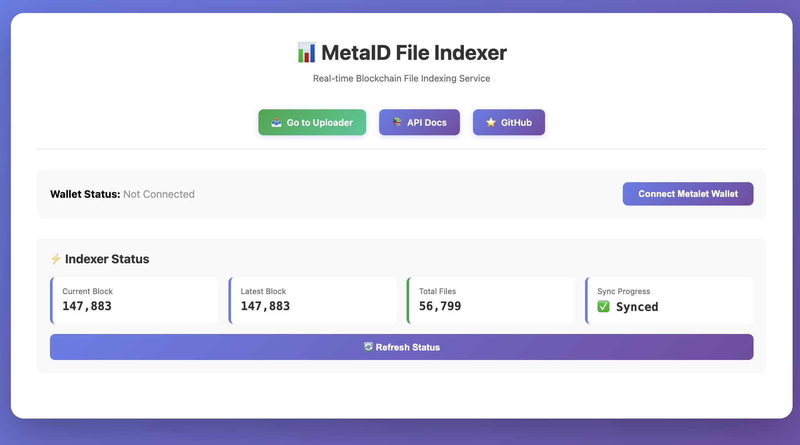

# Meta File System

基于 MetaID 协议的链上文件服务，支持文件上链和索引功能。

[English Version](README.md)

## 功能特性

- 📤 **文件上链**: 将文件通过 MetaID 协议上传到区块链
- 📥 **文件索引**: 从区块链扫描和索引 MetaID 文件
- 🌐 **Web 界面**: 提供可视化的文件上传页面，集成 Metalet 钱包
- 🚀 **OSS 加速直链**: Indexer 支持图片/视频/头像的加速访问与预览参数

## 快速开始

### 前置要求

- Go 1.23+
- MySQL 5.7+
- MVC 节点（用于索引服务）

### 安装依赖

```bash
make deps
# 或
go mod tidy
```

### 配置

复制并修改配置文件：

```bash
cp conf/conf_example.yaml conf/conf_loc.yaml
```

编辑 `conf/conf_loc.yaml`，配置数据库、区块链节点、存储等信息。

### 初始化数据库

```bash
mysql -u root -p < scripts/init.sql
```

或使用 Make 命令：

```bash
make init-db
```

### 构建

```bash
# 构建所有服务
make build

# 或使用脚本
chmod +x scripts/build.sh
./scripts/build.sh
```

### 运行

#### 运行索引服务

索引服务包含两个功能：
1. 后台索引区块链数据
2. 提供查询和下载 API（端口 7281）

```bash
# 使用编译后的二进制
./bin/indexer --config=conf/conf_loc.yaml

# 或直接运行
make run-indexer
```

#### 运行上传服务

上传服务提供文件上传 API（端口 7282）

```bash
# 使用编译后的二进制
./bin/uploader --config=conf/conf_loc.yaml

# 或直接运行
make run-uploader
```

#### 同时运行两个服务

```bash
# 终端 1 - 索引服务
./bin/indexer --config=conf/conf_loc.yaml

# 终端 2 - 上传服务
./bin/uploader --config=conf/conf_loc.yaml
```

### Web 上传界面

Uploader 服务启动后，可以通过浏览器访问可视化上传页面：

```bash
# 访问上传页面
open http://localhost:7282
```

**Web 界面预览：**


**功能**：
- 🔗 连接 Metalet 钱包
- 📁 拖拽上传文件
- ⚙️ 配置上链参数
- ✍️ 自动调用钱包签名
- 📡 一键上链到区块链

## 📚 文档

- **[📤 结合钱包操作的文件上链流程详解（中文）](./UPLOAD_FLOW-ZH.md)** - 结合钱包操作的文件上链完整指南，包含详细步骤和流程图

### Docker 部署

推荐使用 Docker Compose 进行快速部署。

**前置要求**：需要先准备 MySQL 数据库（独立部署或使用云数据库）

#### 完整部署（Indexer + Uploader）

```bash
# 方式一：使用 Makefile
make docker-up

# 方式二：使用 docker-compose
cd deploy
docker-compose up -d
```

**配置数据库连接**：

编辑 `conf/conf_pro.yaml`，配置数据库 DSN：

```yaml
rds:
  # 使用 Docker MySQL 容器
  dsn: "user:pass@tcp(mysql:3306)/metaid_file_system_db?charset=utf8mb4"

```

#### 只部署 Uploader

```bash
# 使用 Makefile
make docker-up-uploader

# 使用 docker-compose
cd deploy
docker-compose -f docker-compose.uploader.yml up -d

# 使用部署脚本
cd deploy
./deploy.sh up uploader
```

#### 只部署 Indexer

```bash
# 使用 Makefile
make docker-up-indexer

# 使用 docker-compose
cd deploy
docker-compose -f docker-compose.indexer.yml up -d

# 使用部署脚本
cd deploy
./deploy.sh up indexer
```

**查看日志**：
```bash
make docker-logs
# 或
cd deploy && ./deploy.sh logs all
```

详细说明：[Docker 部署文档](deploy/README.md) | [快速开始](deploy/QUICKSTART.md)

## API 文档

### API 模块划分

两个服务提供不同的 API 接口：

| 服务 | 端口 | API 功能 | Swagger 文档 |
|------|------|----------|-------------|
| **Uploader** | 7282 | 文件上传、配置查询 | http://localhost:7282/swagger/index.html |
| **Indexer** | 7281 | 文件查询、下载、加速直链 | http://localhost:7281/swagger/index.html |

### 📚 Swagger API 文档

#### Uploader API 文档（v1.0）

Uploader 服务提供了完整的 Swagger 交互式 API 文档。

**访问地址：**
```
http://localhost:7282/swagger/index.html
```

**API 接口列表：**

1. **文件上传**
   - `POST /api/v1/files/pre-upload` - 预上传文件，生成待签名交易
   - `POST /api/v1/files/commit-upload` - 提交已签名交易，广播上链

2. **配置查询**
   - `GET /api/v1/config` - 获取服务配置信息（如最大文件大小）

**响应结构说明：**

所有 API 返回统一的响应格式：
```json
{
  "code": 0,           // 响应码：0=成功, 40000=参数错误, 40400=资源不存在, 50000=服务器错误
  "message": "success", // 响应消息
  "processingTime": 123, // 请求处理时间（毫秒）
  "data": {}           // 响应数据（根据接口不同而不同）
}
```

**Indexer API 文档：** 开发中，敬请期待...

#### Indexer API 文档（v1.0）

Indexer 服务现已提供完整的文件/头像查询与加速直链能力，Swagger 文档已内置。

### Web 索引界面

Indexer 服务启动后，可以通过浏览器访问可视化索引页面：

```bash
# 访问索引页面
open http://localhost:7281
```

**Web 界面预览：**



**访问地址：**
```
http://localhost:7281/swagger/index.html
```

**核心接口：**

1. **文件查询**
   - `GET /api/v1/files`：按 cursor 分页列出文件
   - `GET /api/v1/files/{pinId}`：根据 PinID 获取文件元信息
   - `GET /api/v1/files/content/{pinId}`：直接返回文件内容（本地读取）
   - `GET /api/v1/files/accelerate/content/{pinId}`：返回 OSS 直链，支持图片/视频处理

2. **创作者检索**
   - `GET /api/v1/files/creator/{address}`
   - `GET /api/v1/files/metaid/{metaId}`

3. **头像查询**
   - `GET /api/v1/avatars`：头像分页
   - `GET /api/v1/avatars/content/{pinId}`：返回头像二进制
   - `GET /api/v1/avatars/accelerate/content/{pinId}`：头像 OSS 直链
   - `GET /api/v1/avatars/accelerate/metaid/{metaId}`：根据 MetaID 获取最新头像直链
   - `GET /api/v1/avatars/accelerate/address/{address}`：根据地址获取最新头像直链

4. **同步状态与统计**
   - `GET /api/v1/status`
   - `GET /api/v1/stats`

**加速直链参数：**

`accelerate` 路由支持 `process` 查询参数，示例：`/api/v1/files/accelerate/content/{pinId}?process=preview`

| process 值 | 适用类型 | 说明 |
|------------|----------|------|
| `preview`  | image    | 等比压缩到宽 640px |
| `thumbnail`| image    | 文件：宽 235px；头像：128x128 填充 |
| `video`    | video    | 返回第 1 秒快照图 |
| *空*       | all      | 返回原始 OSS 资源 |

> 提示：要使用加速能力，需要将 `storage.type` 设置为 `oss`，并在配置文件中补充 `storage.oss.domain`，用于拼接外部可访问的 CDN/自定义域名。

### 预上传文件（Uploader 服务）

第一步：预上传，构建未签名的交易

```bash
POST http://localhost:7282/api/v1/files/pre-upload
Content-Type: multipart/form-data

参数：
- file: 文件内容（binary）
- path: MetaID 路径
- metaId: MetaID（可选）
- address: 地址（可选）
- operation: 操作类型（create/modify/revoke，默认：create）
- contentType: 内容类型（可选）
- changeAddress: 找零地址（可选）
- feeRate: 费率（可选，默认：1）
- outputs: 输出列表 JSON（可选）
- otherOutputs: 其他输出列表 JSON（可选）

响应：
{
  "code": 0,
  "message": "success",
  "processingTime": 123,
  "data": {
    "fileId": "metaid_abc123...",        // 文件ID（唯一标识）
    "fileMd5": "5d41402abc4b2a76...",     // 文件MD5
    "fileHash": "2c26b46b68ffc68f...",    // 文件SHA256哈希
    "txId": "abc123...",                   // 交易ID
    "pinId": "abc123...i0",                // PinID
    "preTxRaw": "0100000...",              // 预交易原始数据（十六进制，待签名）
    "status": "pending",                   // 状态：pending/success/failed
    "message": "success",                  // 消息提示
    "calTxFee": 1000,                      // 计算的交易费用（聪）
    "calTxSize": 500                       // 计算的交易大小（字节）
  }
}
```

### 提交上传（Uploader 服务）

第二步：提交已签名的交易

```bash
POST http://localhost:7282/api/v1/files/commit-upload
Content-Type: application/json

请求：
{
  "fileId": "metaid_abc123...",           // 文件ID（从预上传接口获取）
  "signedRawTx": "0100000..."             // 已签名的交易原始数据（十六进制）
}

响应：
{
  "code": 0,
  "message": "success",
  "processingTime": 456,
  "data": {
    "fileId": "metaid_abc123...",         // 文件ID
    "status": "success",                   // 状态：success/failed
    "txId": "abc123...",                   // 交易ID
    "pinId": "abc123...i0",                // PinID
    "message": "success"                   // 消息提示
  }
}
```


## 配置说明

### 数据库配置

```yaml
rds:
  dsn: "user:password@tcp(host:3306)/database?charset=utf8mb4&parseTime=True"
  max_open_conns: 1000
  max_idle_conns: 50
```

### 区块链配置

```yaml
chain:
  rpc_url: "http://127.0.0.1:9882"
  rpc_user: "rpcuser"
  rpc_pass: "rpcpassword"
  start_height: 0  # 索引起始高度
```

### 存储配置

#### 本地存储

```yaml
storage:
  type: "local"
  local:
    base_path: "./data/files"
```

#### 阿里云 OSS

```yaml
storage:
  type: "oss"
  oss:
    endpoint: "oss-cn-hangzhou.aliyuncs.com"
    access_key: "your-access-key"
    secret_key: "your-secret-key"
    bucket: "your-bucket"
    domain: "https://cdn.your-domain.com" # 新增：加速直链所用外网域名
```

### 索引器配置

```yaml
indexer:
  enabled: true
  scan_interval: 10  # 扫描间隔（秒）
  batch_size: 100    # 批量处理大小
  start_height: 0    # 起始高度（0为从数据库最大高度开始）
```

### 上传器配置

```yaml
uploader:
  enabled: true
  max_file_size: 10  # 最大文件大小（10MB）
  fee_rate: 1              # 默认费率
```

## 开发

### 运行测试

```bash
make test
```

### 清理构建产物

```bash
make clean
```

## 许可证

MIT License

## 版本信息

**当前版本：v0.2.0**

### 更新日志

#### v0.2.0 (2025-11-17)

**Indexer 服务**
- ✅ 新增 OSS 加速直链能力（`/accelerate` 路由），支持图片预览、缩略图、视频首帧
- ✅ 支持头像按照 MetaID / 地址获取最新直链
- ✅ Swagger 文档上线 (`http://localhost:7281/swagger/index.html`)

**Uploader 服务**
- ✅ 新增 DirectUpload 流程（直接提交已签名交易）
- ✅ Swagger 增加 `POST /api/v1/files/direct-upload`

#### v0.1.0 (2025-10-16)

**Uploader 服务**
- ✅ 完整的文件上传功能（预上传 + 提交上传）
- ✅ 完善的 Swagger API 文档
- ✅ Web 可视化上传界面（集成 Metalet 钱包）