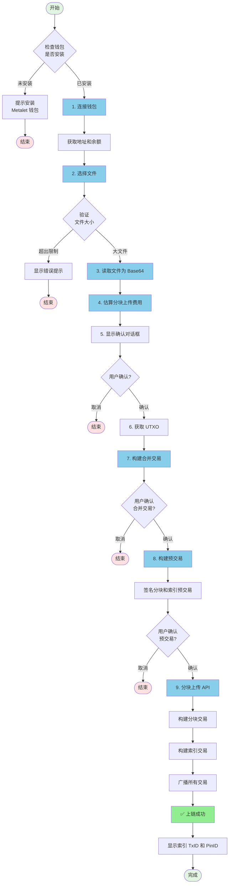

# 📤 MetaID 文件上链流程详解 - 分块上传方式

本文档详细说明如何使用 Meta Media Uploader 的 **分块上传（Chunked Upload）** 方法将大文件上传到区块链。

**[English Version](./UPLOAD_FLOW_CHUNKED.md)**

## 📋 目录

- [流程概览](#流程概览)
- [详细步骤](#详细步骤)
  - [步骤 1: 连接 Metalet 钱包](#步骤-1-连接-metalet-钱包)
  - [步骤 2: 选择文件](#步骤-2-选择文件)
  - [步骤 3: 读取文件并转换为 Base64](#步骤-3-读取文件并转换为-base64)
  - [步骤 4: 估算分块上传费用](#步骤-4-估算分块上传费用)
  - [步骤 5: 显示确认对话框](#步骤-5-显示确认对话框)
  - [步骤 6: 获取 UTXO 用于合并交易](#步骤-6-获取-utxo-用于合并交易)
  - [步骤 7: 构建合并交易](#步骤-7-构建合并交易)
  - [步骤 8: 构建并签名预交易](#步骤-8-构建并签名预交易)
  - [步骤 9: 分块上传](#步骤-9-分块上传)
- [API 接口说明](#api-接口说明)
- [代码示例](#代码示例)
- [常见问题](#常见问题)

---

## 🎯 流程概览

分块上传方法专为**大文件**（通常 > 10MB）设计。它将文件分割成多个分块并分别上传到区块链，减少单个交易的大小并提高可靠性。



---

## 📝 详细步骤

### 步骤 1: 连接 Metalet 钱包

#### 1.1 检查钱包插件

首先检查用户是否已安装 Metalet 钱包浏览器插件：

```javascript
// 检查钱包是否已安装
if (typeof window.metaidwallet === 'undefined') {
    alert('请先安装 Metalet 钱包插件！');
    window.open('https://www.metalet.space/', '_blank');
    return;
}
```

#### 1.2 连接钱包

调用钱包的 `connect()` 方法请求用户授权：

```javascript
// 连接钱包
const account = await window.metaidwallet.connect();

// 获取地址（兼容不同版本的钱包 API）
const address = account.address || account.mvcAddress || account.btcAddress;

console.log('钱包地址:', address);
```

#### 1.3 获取余额

连接成功后，获取用户的钱包余额：

```javascript
// 获取余额
const balance = await window.metaidwallet.getBalance();

console.log('总余额:', balance.total, 'satoshis');
console.log('已确认:', balance.confirmed, 'satoshis');
console.log('未确认:', balance.unconfirmed, 'satoshis');
```

#### 1.4 计算 MetaID

使用地址的 SHA256 哈希作为 MetaID：

```javascript
async function calculateMetaID(address) {
    const encoder = new TextEncoder();
    const data = encoder.encode(address);
    const hashBuffer = await crypto.subtle.digest('SHA-256', data);
    const hashArray = Array.from(new Uint8Array(hashBuffer));
    const hashHex = hashArray.map(b => b.toString(16).padStart(2, '0')).join('');
    return hashHex;
}

const metaId = await calculateMetaID(address);
console.log('MetaID:', metaId);
```

---

### 步骤 2: 选择文件

#### 2.1 文件选择

用户通过拖放或点击选择要上传的文件：

```javascript
// 处理文件选择
function handleFile(file) {
    // 验证文件大小
    if (file.size > maxFileSize) {
        alert(`文件过大！最大限制: ${formatFileSize(maxFileSize)}`);
        return;
    }
    
    selectedFile = file;
    console.log('文件已选择:', file.name, formatFileSize(file.size));
}
```

#### 2.2 构建 ContentType

为文件构建正确的 ContentType（类型 + ;binary 后缀）：

```javascript
// 构建 ContentType
let contentType = file.type || 'application/octet-stream';
if (!contentType.includes(';binary')) {
    contentType = contentType + ';binary';
}

// 示例：
// - image/png → image/png;binary
// - application/pdf → application/pdf;binary
// - text/plain → text/plain;binary
```

---

### 步骤 3: 读取文件并转换为 Base64

读取文件内容并转换为 base64 格式以便传输：

```javascript
// 读取文件为 base64
function readFileAsBase64(file) {
    return new Promise((resolve, reject) => {
        const reader = new FileReader();
        reader.onload = () => {
            // 移除 data URL 前缀（例如 "data:image/jpeg;base64,"）
            const base64 = reader.result.split(',')[1] || reader.result;
            resolve(base64);
        };
        reader.onerror = reject;
        reader.readAsDataURL(file);
    });
}

const fileContent = await readFileAsBase64(selectedFile);
console.log('文件读取成功:', formatFileSize(selectedFile.size));
```

---

### 步骤 4: 估算分块上传费用

估算分块上传所需的总费用，包括分块交易和索引交易：

```javascript
// 估算分块上传费用
async function estimateChunkedUploadFee(fileContentBase64) {
    try {
        const path = document.getElementById('pathInput').value;
        const contentType = buildContentType(selectedFile);
        
        const requestBody = {
            fileName: selectedFile.name,
            content: fileContentBase64,
            path: path,
            contentType: contentType,
            feeRate: Number(document.getElementById('feeRateInput').value) || 1
        };
        
        const response = await fetch(`${API_BASE}/api/v1/files/estimate-chunked-upload`, {
            method: 'POST',
            headers: {
                'Content-Type': 'application/json'
            },
            body: JSON.stringify(requestBody)
        });
        
        if (!response.ok) {
            throw new Error(`HTTP 错误: ${response.status}`);
        }
        
        const result = await response.json();
        
        if (result.code !== 0) {
            throw new Error(result.message);
        }
        
        console.log('估算成功:', result.data);
        return result.data;
    } catch (error) {
        console.error('估算分块上传费用失败:', error);
        throw new Error(`估算费用失败: ${error.message}`);
    }
}
```

#### 4.1 响应数据

```json
{
    "code": 0,
    "message": "success",
    "data": {
        "chunkNumber": 5,
        "chunkSize": 2097152,
        "chunkPreTxFee": 50000,
        "indexPreTxFee": 10000,
        "totalFee": 60000,
        "perChunkFee": 12000
    }
}
```

**响应字段：**
- `chunkNumber`: 文件将被分割的分块数量
- `chunkSize`: 每个分块的大小（字节）
- `chunkPreTxFee`: 分块资助交易的总费用（向助手地址的多个输出）
- `indexPreTxFee`: 索引交易的费用
- `totalFee`: 整个分块上传的总费用
- `perChunkFee`: 每个分块交易的费用

---

### 步骤 5: 显示确认对话框

显示一个确认对话框，展示分块详情和费用信息：

```javascript
// 显示分块上传确认对话框
function showChunkedUploadConfirmation(estimateResult) {
    return new Promise((resolve) => {
        // 创建模态对话框
        const modal = document.createElement('div');
        modal.style.cssText = `
            position: fixed;
            top: 0;
            left: 0;
            width: 100%;
            height: 100%;
            background: rgba(0, 0, 0, 0.5);
            display: flex;
            justify-content: center;
            align-items: center;
            z-index: 10000;
        `;
        
        const dialog = document.createElement('div');
        dialog.innerHTML = `
            <h2>📦 分块上传确认</h2>
            <div>
                <strong>📊 文件信息：</strong>
                <ul>
                    <li>文件名: ${selectedFile.name}</li>
                    <li>文件大小: ${formatFileSize(selectedFile.size)}</li>
                    <li>分块大小: ${formatFileSize(estimateResult.chunkSize)}</li>
                    <li>分块数量: ${estimateResult.chunkNumber}</li>
                </ul>
                <strong>💰 费用信息：</strong>
                <ul>
                    <li>分块资助费用: ${formatSatoshis(estimateResult.chunkPreTxFee)}</li>
                    <li>索引交易费用: ${formatSatoshis(estimateResult.indexPreTxFee)}</li>
                    <li>总费用: ${formatSatoshis(estimateResult.totalFee)}</li>
                    <li>每分块费用: ${formatSatoshis(estimateResult.perChunkFee)}</li>
                </ul>
                <p>
                    您需要确认 ${estimateResult.chunkNumber + 2} 笔交易：
                    <br>1. 分块资助交易（${estimateResult.chunkNumber} 个输出）
                    <br>2. ${estimateResult.chunkNumber} 笔分块交易
                    <br>3. 索引交易
                </p>
            </div>
            <button id="confirmChunkedUpload">确认并上传</button>
            <button id="cancelChunkedUpload">取消</button>
        `;
        
        document.body.appendChild(modal);
        modal.appendChild(dialog);
        
        // 处理按钮点击
        document.getElementById('confirmChunkedUpload').addEventListener('click', () => {
            document.body.removeChild(modal);
            resolve(true);
        });
        
        document.getElementById('cancelChunkedUpload').addEventListener('click', () => {
            document.body.removeChild(modal);
            resolve(false);
        });
    });
}

const confirmed = await showChunkedUploadConfirmation(estimateResult);
if (!confirmed) {
    console.log('用户取消分块上传');
    return;
}
```

---

### 步骤 6: 获取 UTXO 用于合并交易

从钱包获取 UTXO 以创建合并交易，该交易将为分块和索引预交易提供资金：

```javascript
// 计算合并交易所需的总金额
const preTxBaseSize = 200;
const preTxInputSize = 150;
const feeRate = Number(document.getElementById('feeRateInput').value) || 1;

// 估算分块 PreTx 大小（1 个输入，尚无输出 - 后端将添加）
const chunkPreTxSize = preTxBaseSize + preTxInputSize;
const chunkPreTxBuildFee = Math.ceil(chunkPreTxSize * feeRate);

// 估算索引 PreTx 大小（1 个输入，尚无输出 - 后端将添加）
const indexPreTxSize = preTxBaseSize + preTxInputSize;
const indexPreTxBuildFee = Math.ceil(indexPreTxSize * feeRate);

// 计算合并交易所需的总金额
// chunkPreTxOutput = chunkPreTxFee + chunkPreTxBuildFee
// indexPreTxOutput = indexPreTxFee + indexPreTxBuildFee
// mergeTxFee = 合并交易费用
const chunkPreTxOutputAmount = estimateResult.chunkPreTxFee + chunkPreTxBuildFee;
const indexPreTxOutputAmount = estimateResult.indexPreTxFee + indexPreTxBuildFee;

// 估算合并交易费用
const mergeTxBaseSize = 200;
const mergeTxInputSize = 150;
const mergeTxOutputSize = 34;
const estimatedMergeTxInputs = 2; // 假设 2 个输入
const mergeTxSize = mergeTxBaseSize + (mergeTxInputSize * estimatedMergeTxInputs) + (mergeTxOutputSize * 2); // 2 个输出
const mergeTxFee = Math.ceil(mergeTxSize * feeRate);

const totalRequiredAmount = chunkPreTxOutputAmount + indexPreTxOutputAmount + mergeTxFee;

// 获取 UTXO
const allUtxos = await getWalletUTXOs(totalRequiredAmount);
console.log(`获取到 ${allUtxos.utxos.length} 个 UTXO，总计: ${allUtxos.totalAmount} satoshis`);
```

---

### 步骤 7: 构建合并交易

构建一个包含两个输出的合并交易：一个用于分块 PreTx 资助，一个用于索引 PreTx 资助：

```javascript
// 构建分块上传的合并交易（创建两个输出：chunkPreTx 和 indexPreTx）
async function buildChunkedUploadMergeTx(utxoData, chunkPreTxOutputAmount, indexPreTxOutputAmount, mergeTxFee) {
    try {
        const metaContract = window.metaContract;
        if (!metaContract) {
            throw new Error('meta-contract 库未加载');
        }
        
        const mvc = metaContract.mvc;
        const TxComposer = metaContract.TxComposer;
        
        // 创建包含两个输出的合并交易
        const mergeTx = new mvc.Transaction();
        mergeTx.version = 10;
        
        // 从 UTXO 添加输入
        for (const utxo of utxoData.utxos) {
            mergeTx.from({
                txId: utxo.txId,
                outputIndex: utxo.outputIndex,
                script: utxo.script,
                satoshis: utxo.satoshis
            });
        }
        
        // 添加两个输出：一个用于分块 PreTx，一个用于索引 PreTx
        mergeTx.to(currentAddress, chunkPreTxOutputAmount);
        mergeTx.to(currentAddress, indexPreTxOutputAmount);
        
        // 使用 pay 方法签名并广播
        const wallet = getWallet();
        if (!wallet || typeof wallet.pay !== 'function') {
            throw new Error('钱包不支持 pay 方法');
        }
        
        // 创建 TxComposer
        const txComposer = new TxComposer(mergeTx);
        const txComposerSerialize = txComposer.serialize();
        
        // 构建 pay 参数
        const feeRate = Number(document.getElementById('feeRateInput').value) || 1;
        const payParams = {
            transactions: [
                {
                    txComposer: txComposerSerialize,
                    message: '合并 UTXO 用于分块上传',
                }
            ],
            feeb: feeRate,
        };
        
        const payResult = await wallet.pay(payParams);
        
        // 反序列化已支付的交易
        const payedTxComposerStr = payResult.payedTransactions[0];
        const payedTxComposer = TxComposer.deserialize(payedTxComposerStr);
        
        // 获取签名后的交易 hex
        const signedMergeTxHex = payedTxComposer.getRawHex();
        const mergeTxId = payedTxComposer.getTxId();
        
        // 解析交易以获取输出信息
        const parsedMergeTx = new mvc.Transaction(signedMergeTxHex);
        
        // 通过金额匹配找到输出（考虑费用计算差异的容差）
        let chunkPreTxOutputIndex = -1;
        let indexPreTxOutputIndex = -1;
        let chunkPreTxScript = null;
        let indexPreTxScript = null;
        
        const amountTolerance = 1000; // 1000 satoshis 容差
        
        // 通过金额匹配找到输出
        for (let i = 0; i < parsedMergeTx.outputs.length; i++) {
            const output = parsedMergeTx.outputs[i];
            const outputScript = output.script.toHex();
            const outputAmount = output.satoshis;
            
            try {
                const addr = output.script.toAddress(mvc.Networks.livenet);
                if (addr && addr.toString() === currentAddress) {
                    // 通过金额匹配分块 PreTx 输出
                    if (chunkPreTxOutputIndex === -1 && 
                        Math.abs(outputAmount - chunkPreTxOutputAmount) <= amountTolerance) {
                        chunkPreTxOutputIndex = i;
                        chunkPreTxScript = outputScript;
                    }
                    // 通过金额匹配索引 PreTx 输出
                    else if (indexPreTxOutputIndex === -1 && 
                             Math.abs(outputAmount - indexPreTxOutputAmount) <= amountTolerance) {
                        indexPreTxOutputIndex = i;
                        indexPreTxScript = outputScript;
                    }
                }
            } catch (e) {
                continue;
            }
        }
        
        return {
            mergeTxId: mergeTxId,
            mergeTxHex: signedMergeTxHex,
            chunkPreTxOutputIndex: chunkPreTxOutputIndex,
            indexPreTxOutputIndex: indexPreTxOutputIndex,
            chunkPreTxScript: chunkPreTxScript,
            indexPreTxScript: indexPreTxScript
        };
        
    } catch (error) {
        console.error('构建合并交易失败:', error);
        throw new Error(`构建合并交易失败: ${error.message}`);
    }
}
```

---

### 步骤 8: 构建并签名预交易

构建两个使用 SIGHASH_NONE 签名的预交易，允许后端稍后添加输出：

#### 8.1 构建分块资助预交易

```javascript
// 构建分块资助预交易（向助手地址的多个输出）
async function buildChunkFundingPreTx(utxoData, totalChunkFee) {
    try {
        const metaContract = window.metaContract;
        if (!metaContract) {
            throw new Error('meta-contract 库未加载');
        }
        
        const mvc = metaContract.mvc;
        
        // 创建仅包含输入的交易（尚无输出 - 后端将添加）
        const tx = new mvc.Transaction();
        tx.version = 10;
        
        // 从 UTXO 添加输入
        for (const utxo of utxoData.utxos) {
            tx.from({
                txId: utxo.txId,
                outputIndex: utxo.outputIndex,
                script: utxo.script,
                satoshis: utxo.satoshis
            });
        }
        
        // 使用 signNull 签名（SIGHASH_NONE | SIGHASH_ANYONECANPAY = 0x80 | 0x40 = 0xC0）
        const wallet = getWallet();
        if (!wallet || typeof wallet.signTransaction !== 'function') {
            throw new Error('钱包不支持 signTransaction');
        }
        
        // 使用 signNull 签名每个输入
        for (let i = 0; i < utxoData.utxos.length; i++) {
            const utxo = utxoData.utxos[i];
            const signResult = await wallet.signTransaction({
                transaction: {
                    txHex: tx.toString(),
                    address: currentAddress,
                    inputIndex: i,
                    scriptHex: utxo.script,
                    satoshis: utxo.satoshis,
                    sigtype: 0x2 | 0x40 // SIGHASH_NONE | SIGHASH_ANYONECANPAY
                }
            });
            
            const sig = signResult.signature.sig;
            const publicKey = signResult.signature.publicKey;
            const unlockingScript = mvc.Script.buildPublicKeyHashIn(
                publicKey,
                mvc.crypto.Signature.fromTxFormat(Buffer.from(sig, 'hex')).toDER(),
                0x2 | 0x40
            );
            tx.inputs[i].setScript(unlockingScript);
        }
        
        const signedTxHex = tx.toString();
        return signedTxHex;
        
    } catch (error) {
        console.error('构建分块资助预交易失败:', error);
        throw new Error(`构建分块资助预交易失败: ${error.message}`);
    }
}
```

#### 8.2 构建索引预交易

```javascript
// 构建索引预交易
async function buildIndexPreTx(utxoData, indexFee) {
    try {
        const metaContract = window.metaContract;
        if (!metaContract) {
            throw new Error('meta-contract 库未加载');
        }
        
        const mvc = metaContract.mvc;
        
        const tx = new mvc.Transaction();
        tx.version = 10;
        
        // 从 UTXO 添加输入
        for (const utxo of utxoData.utxos) {
            tx.from({
                txId: utxo.txId,
                outputIndex: utxo.outputIndex,
                script: utxo.script,
                satoshis: utxo.satoshis
            });
        }
        
        // 尚无输出 - 后端将添加 OP_RETURN 和找零输出
        const wallet = getWallet();
        if (!wallet || typeof wallet.signTransaction !== 'function') {
            throw new Error('钱包不支持 signTransaction');
        }
        
        // 使用 signNull 签名每个输入
        for (let i = 0; i < utxoData.utxos.length; i++) {
            const utxo = utxoData.utxos[i];
            const signResult = await wallet.signTransaction({
                transaction: {
                    txHex: tx.toString(),
                    address: currentAddress,
                    inputIndex: i,
                    scriptHex: utxo.script,
                    satoshis: utxo.satoshis,
                    sigtype: 0x2 | 0x40 // SIGHASH_NONE | SIGHASH_ANYONECANPAY
                }
            });
            
            const sig = signResult.signature.sig;
            const publicKey = signResult.signature.publicKey;
            const unlockingScript = mvc.Script.buildPublicKeyHashIn(
                publicKey,
                mvc.crypto.Signature.fromTxFormat(Buffer.from(sig, 'hex')).toDER(),
                0x2 | 0x40
            );
            tx.inputs[i].setScript(unlockingScript);
        }
        
        const signedTxHex = tx.toString();
        return signedTxHex;
        
    } catch (error) {
        console.error('构建索引预交易失败:', error);
        throw new Error(`构建索引预交易失败: ${error.message}`);
    }
}
```

#### 8.3 使用合并交易输出构建预交易

```javascript
// 使用合并交易输出构建分块资助预交易
const chunkPreTxUtxo = {
    utxos: [{
        txId: mergeResult.mergeTxId,
        outputIndex: mergeResult.chunkPreTxOutputIndex,
        script: mergeResult.chunkPreTxScript,
        satoshis: chunkPreTxOutputAmount
    }],
    totalAmount: chunkPreTxOutputAmount
};
const chunkPreTxHex = await buildChunkFundingPreTx(chunkPreTxUtxo, estimateResult.chunkPreTxFee);

// 使用合并交易输出构建索引预交易
const indexPreTxUtxo = {
    utxos: [{
        txId: mergeResult.mergeTxId,
        outputIndex: mergeResult.indexPreTxOutputIndex,
        script: mergeResult.indexPreTxScript,
        satoshis: indexPreTxOutputAmount
    }],
    totalAmount: indexPreTxOutputAmount
};
const indexPreTxHex = await buildIndexPreTx(indexPreTxUtxo, estimateResult.indexPreTxFee);
```

---

### 步骤 9: 分块上传

将预交易提交给分块上传 API，它将构建所有分块交易和索引交易：

```javascript
// 分块上传
async function chunkedUpload(fileContentBase64, chunkPreTxHex, indexPreTxHex, mergeTxHex) {
    try {
        const path = document.getElementById('pathInput').value;
        const contentType = buildContentType(selectedFile);
        const metaId = await calculateMetaID(currentAddress);
        
        const requestBody = {
            metaId: metaId,
            address: currentAddress,
            fileName: selectedFile.name,
            content: fileContentBase64,
            path: path,
            operation: document.getElementById('operationSelect').value || 'create',
            contentType: contentType,
            chunkPreTxHex: chunkPreTxHex,
            indexPreTxHex: indexPreTxHex,
            mergeTxHex: mergeTxHex, // 合并交易 hex，用于广播
            feeRate: Number(document.getElementById('feeRateInput').value) || 1,
            isBroadcast: true // 自动广播
        };
        
        const response = await fetch(`${API_BASE}/api/v1/files/chunked-upload`, {
            method: 'POST',
            headers: {
                'Content-Type': 'application/json'
            },
            body: JSON.stringify(requestBody)
        });
        
        if (!response.ok) {
            throw new Error(`HTTP 错误: ${response.status}`);
        }
        
        const result = await response.json();
        
        if (result.code !== 0) {
            throw new Error(result.message);
        }
        
        console.log('分块上传成功！');
        console.log('索引 TxID:', result.data.indexTxId);
        
        return result.data;
    } catch (error) {
        console.error('分块上传失败:', error);
        throw new Error(`分块上传失败: ${error.message}`);
    }
}
```

#### 9.1 响应数据

```json
{
    "code": 0,
    "message": "success",
    "data": {
        "indexTxId": "abc123...",
        "status": "success",
        "chunkTxIds": ["chunk1...", "chunk2...", "chunk3..."]
    }
}
```

**响应字段：**
- `indexTxId`: 索引交易的交易 ID（用作 PinID：`{indexTxId}i0`）
- `status`: 上传状态
- `chunkTxIds`: 所有分块交易的交易 ID 数组

---

## 🔌 API 接口说明

### 1. 估算分块上传费用

估算分块上传所需的总费用。

```http
POST /api/v1/files/estimate-chunked-upload
Content-Type: application/json
```

**请求参数：**

| 参数 | 类型 | 必填 | 说明 |
|------|------|------|------|
| fileName | String | 是 | 文件名 |
| content | String | 是 | base64 格式的文件内容 |
| path | String | 是 | 文件路径（如：`/file`） |
| contentType | String | 否 | 内容类型（建议加 `;binary` 后缀） |
| feeRate | Integer | 否 | 费率（satoshis/byte，默认：1） |

**响应示例：**

```json
{
    "code": 0,
    "message": "success",
    "data": {
        "chunkNumber": 5,
        "chunkSize": 2097152,
        "chunkPreTxFee": 50000,
        "indexPreTxFee": 10000,
        "totalFee": 60000,
        "perChunkFee": 12000
    }
}
```

---

### 2. 分块上传

使用分块上传方法上传大文件。

```http
POST /api/v1/files/chunked-upload
Content-Type: application/json
```

**请求参数：**

| 参数 | 类型 | 必填 | 说明 |
|------|------|------|------|
| metaId | String | 是 | 用户的 MetaID（地址的 SHA256） |
| address | String | 是 | 用户的区块链地址 |
| fileName | String | 是 | 文件名 |
| content | String | 是 | base64 格式的文件内容 |
| path | String | 是 | 文件路径（如：`/file`） |
| chunkPreTxHex | String | 是 | 分块资助预交易 hex（使用 SIGHASH_NONE 签名） |
| indexPreTxHex | String | 是 | 索引预交易 hex（使用 SIGHASH_NONE 签名） |
| mergeTxHex | String | 是 | 合并交易 hex（用于广播） |
| operation | String | 否 | 操作类型（默认：`create`） |
| contentType | String | 否 | 内容类型（建议加 `;binary` 后缀） |
| feeRate | Integer | 否 | 费率（satoshis/byte，默认：1） |
| isBroadcast | Boolean | 否 | 自动广播交易（默认：true） |

**响应示例：**

```json
{
    "code": 0,
    "message": "success",
    "data": {
        "indexTxId": "abc123...",
        "status": "success",
        "chunkTxIds": ["chunk1...", "chunk2...", "chunk3..."]
    }
}
```

---

## 💻 代码示例

### 完整的分块上传流程代码

```javascript
/**
 * 完整的分块上传流程
 */
async function uploadFileToChainChunked(file) {
    try {
        // 1. 连接钱包
        const account = await window.metaidwallet.connect();
        const address = account.address || account.mvcAddress;
        const metaId = await calculateMetaID(address);
        
        console.log('✅ 钱包已连接:', address);
        
        // 2. 读取文件为 base64
        const fileContent = await readFileAsBase64(file);
        console.log('✅ 文件读取成功');
        
        // 3. 估算分块上传费用
        const estimateResult = await estimateChunkedUploadFee(fileContent);
        console.log('💰 预估费用:', formatSatoshis(estimateResult.totalFee));
        console.log('📊 分块数:', estimateResult.chunkNumber);
        
        // 4. 显示确认对话框
        const confirmed = await showChunkedUploadConfirmation(estimateResult);
        if (!confirmed) {
            console.log('用户取消');
            return;
        }
        
        // 5. 获取 UTXO 用于合并交易
        const feeRate = Number(document.getElementById('feeRateInput').value) || 1;
        const chunkPreTxSize = 200 + 150;
        const chunkPreTxBuildFee = Math.ceil(chunkPreTxSize * feeRate);
        const indexPreTxSize = 200 + 150;
        const indexPreTxBuildFee = Math.ceil(indexPreTxSize * feeRate);
        const chunkPreTxOutputAmount = estimateResult.chunkPreTxFee + chunkPreTxBuildFee;
        const indexPreTxOutputAmount = estimateResult.indexPreTxFee + indexPreTxBuildFee;
        const mergeTxFee = Math.ceil(500 * feeRate);
        const totalRequiredAmount = chunkPreTxOutputAmount + indexPreTxOutputAmount + mergeTxFee;
        
        const allUtxos = await getWalletUTXOs(totalRequiredAmount);
        console.log('✅ 获取到 UTXO');
        
        // 6. 构建合并交易
        const mergeResult = await buildChunkedUploadMergeTx(
            allUtxos,
            chunkPreTxOutputAmount,
            indexPreTxOutputAmount,
            mergeTxFee
        );
        console.log('✅ 合并交易构建完成');
        
        // 7. 构建并签名预交易
        const chunkPreTxUtxo = {
            utxos: [{
                txId: mergeResult.mergeTxId,
                outputIndex: mergeResult.chunkPreTxOutputIndex,
                script: mergeResult.chunkPreTxScript,
                satoshis: chunkPreTxOutputAmount
            }],
            totalAmount: chunkPreTxOutputAmount
        };
        const chunkPreTxHex = await buildChunkFundingPreTx(chunkPreTxUtxo, estimateResult.chunkPreTxFee);
        
        const indexPreTxUtxo = {
            utxos: [{
                txId: mergeResult.mergeTxId,
                outputIndex: mergeResult.indexPreTxOutputIndex,
                script: mergeResult.indexPreTxScript,
                satoshis: indexPreTxOutputAmount
            }],
            totalAmount: indexPreTxOutputAmount
        };
        const indexPreTxHex = await buildIndexPreTx(indexPreTxUtxo, estimateResult.indexPreTxFee);
        
        console.log('✅ 预交易签名完成');
        
        // 8. 分块上传
        const uploadResult = await chunkedUpload(
            fileContent,
            chunkPreTxHex,
            indexPreTxHex,
            mergeResult.mergeTxHex
        );
        
        console.log('✅ 文件上传成功！');
        console.log('索引 TxID:', uploadResult.indexTxId);
        console.log('PinID:', uploadResult.indexTxId + 'i0');
        
        return uploadResult;
        
    } catch (error) {
        console.error('❌ 分块上传失败:', error.message);
        throw error;
    }
}
```

---

## ❓ 常见问题

### Q1: 什么时候应该使用分块上传而不是直接上传？

**A:** 对于**大文件**（通常 > 10MB）使用分块上传：
- 大于 10MB 的文件会自动使用分块上传处理
- 分块上传将文件分割成多个交易，减少单个交易的大小
- 更适合区块链网络兼容性
- 允许上传大于典型交易大小限制的文件

对于**小文件**（< 10MB）使用直接上传：
- 上传过程更快
- 需要更少的交易
- 小文件的总费用更低

---

### Q2: 分块是如何工作的？

**A:** 文件被分割成固定大小的分块（通常每个分块 2MB）：

```javascript
// 服务器端分块逻辑（概念性）
const chunkSize = 2 * 1024 * 1024; // 2MB
const chunks = [];
for (let i = 0; i < fileContent.length; i += chunkSize) {
    chunks.push(fileContent.slice(i, i + chunkSize));
}
```

每个分块作为单独的交易上传到区块链，索引交易引用所有分块。

---

### Q3: 合并交易有什么用？

**A:** 合并交易创建两个独立的 UTXO：
1. **分块 PreTx UTXO**: 资助分块资助交易（创建向助手地址的多个输出）
2. **索引 PreTx UTXO**: 资助索引交易

这种分离允许后端：
- 独立构建分块交易
- 单独构建索引交易
- 更准确地管理费用

---

### Q4: 为什么对预交易使用 SIGHASH_NONE？

**A:** SIGHASH_NONE 允许后端在签名后添加输出：
- **分块 PreTx**: 后端添加向助手地址的多个输出（每个分块一个）
- **索引 PreTx**: 后端添加 OP_RETURN 输出和找零输出

这使得：
- 后端灵活构建交易
- 准确计算费用
- 支持可变数量的分块

---

### Q5: 将创建多少笔交易？

**A:** 对于分割成 N 个分块的文件，总交易数为：

```
1. 合并交易（如果存在多个 UTXO）
2. 分块资助交易（1 笔交易）
3. N 笔分块交易（N 笔交易）
4. 索引交易（1 笔交易）

总计：N + 3（如果不需要合并则为 N + 2）
```

**示例：** 对于分割成 6 个分块的 12MB 文件：
- 合并交易：1
- 分块资助交易：1
- 分块交易：6
- 索引交易：1
- **总计：9 笔交易**

---

### Q6: 什么是索引交易？

**A:** 索引交易包含：
- **OP_RETURN 输出**: 包含文件元数据的 MetaID 协议数据
- **对所有分块交易的引用**: 将所有分块链接在一起
- **文件元数据**: 名称、大小、内容类型等

索引交易的 TxID 用作 PinID（格式：`{indexTxId}i0`）。

---

### Q7: 如果一笔分块交易失败怎么办？

**A:** 如果分块交易广播失败：
- 后端将重试广播失败的交易
- 检查响应状态以了解各个分块交易的状态
- 失败的分块可能需要手动重试，或者整个上传可能需要重新开始

**最佳实践：** 监控所有交易确认，确保所有分块都成功上传。

---

### Q8: 如何验证分块上传是否完成？

**A:** 通过以下方式验证：
1. **检查索引交易**: `https://www.mvcscan.com/tx/{indexTxId}`
2. **检查分块交易**: 验证 `chunkTxIds` 数组中的所有分块 TxID
3. **通过索引器 API 查询**: 
   ```javascript
   const response = await fetch(`/api/v1/files/${indexTxId}`);
   const result = await response.json();
   console.log('文件信息:', result.data);
   ```

---

## 🔗 相关链接

- **Metalet 钱包下载：** https://www.metalet.space/
- **MetaID 文档：** https://docs.metaid.io/
- **MVC 区块链浏览器：** https://www.mvcscan.com/
- **MetaID Pin 浏览器：** https://man.metaid.io/
- **GitHub 仓库：** https://github.com/metaid-developers/meta-file-system

---

## 📞 技术支持

如有问题，请联系：

- 提交 Issue: https://github.com/metaid-developers/meta-file-system/issues

---

**最后更新时间：** 2025-01-17

