# 📤 MetaID File Upload to Chain - Chunked Upload Guide

This document provides a detailed explanation of how to upload large files to the blockchain using Meta Media Uploader's **Chunked Upload** method.

**[中文版 / Chinese Version](./UPLOAD_FLOW_CHUNKED-ZH.md)**

## 📋 Table of Contents

- [Process Overview](#process-overview)
- [Detailed Steps](#detailed-steps)
  - [Step 1: Connect Metalet Wallet](#step-1-connect-metalet-wallet)
  - [Step 2: Select File](#step-2-select-file)
  - [Step 3: Read File and Convert to Base64](#step-3-read-file-and-convert-to-base64)
  - [Step 4: Estimate Chunked Upload Fee](#step-4-estimate-chunked-upload-fee)
  - [Step 5: Show Confirmation Dialog](#step-5-show-confirmation-dialog)
  - [Step 6: Get UTXOs for Merge Transaction](#step-6-get-utxos-for-merge-transaction)
  - [Step 7: Build Merge Transaction](#step-7-build-merge-transaction)
  - [Step 8: Build and Sign Pre-Transactions](#step-8-build-and-sign-pre-transactions)
  - [Step 9: Chunked Upload](#step-9-chunked-upload)
- [API Reference](#api-reference)
- [Code Examples](#code-examples)
- [FAQ](#faq)

---

## 🎯 Process Overview

The Chunked Upload method is designed for **large files** (typically > 10MB). It splits the file into multiple chunks and uploads them separately to the blockchain, reducing individual transaction size and improving reliability.

```mermaid
graph TB
    Start([Start]) --> CheckWallet{Check if wallet<br/>is installed}
    CheckWallet -->|Not installed| InstallWallet[Prompt to install<br/>Metalet Wallet]
    InstallWallet --> End1([End])
    
    CheckWallet -->|Installed| ConnectWallet[1. Connect Wallet]
    ConnectWallet --> GetAddress[Get address and balance]
    GetAddress --> SelectFile[2. Select File]
    
    SelectFile --> CheckSize{Validate<br/>file size}
    CheckSize -->|Exceeds limit| ShowError1[Show error message]
    ShowError1 --> End2([End])
    
    CheckSize -->|Large file| ReadFile[3. Read File to Base64]
    ReadFile --> EstimateFee[4. Estimate Chunked Upload Fee]
    
    EstimateFee --> ShowConfirm[5. Show Confirmation Dialog]
    ShowConfirm --> UserConfirm{User confirms?}
    UserConfirm -->|Cancel| End3([End])
    
    UserConfirm -->|Confirm| GetUTXOs[6. Get UTXOs]
    GetUTXOs --> BuildMerge[7. Build Merge Transaction]
    BuildMerge --> SignMerge{User confirms<br/>merge tx?}
    SignMerge -->|Cancel| End4([End])
    
    SignMerge -->|Confirm| BuildPreTxs[8. Build Pre-Transactions]
    BuildPreTxs --> SignPreTxs[Sign Chunk & Index Pre-Txs]
    SignPreTxs --> UserConfirmPre{User confirms<br/>pre-txs?}
    UserConfirmPre -->|Cancel| End5([End])
    
    UserConfirmPre -->|Confirm| ChunkedUpload[9. Chunked Upload API]
    ChunkedUpload --> BuildChunks[Build Chunk Transactions]
    BuildChunks --> BuildIndex[Build Index Transaction]
    BuildIndex --> BroadcastAll[Broadcast All Transactions]
    BroadcastAll --> Success[✅ Upload Success]
    Success --> ShowLinks[Show Index TxID and PinID]
    ShowLinks --> End6([Complete])
    
    style Start fill:#e1f5e1
    style End1 fill:#ffe1e1
    style End2 fill:#ffe1e1
    style End3 fill:#ffe1e1
    style End4 fill:#ffe1e1
    style End5 fill:#ffe1e1
    style End6 fill:#e1f5e1
    style Success fill:#90EE90
    style ConnectWallet fill:#87CEEB
    style SelectFile fill:#87CEEB
    style ReadFile fill:#87CEEB
    style EstimateFee fill:#87CEEB
    style BuildMerge fill:#87CEEB
    style BuildPreTxs fill:#87CEEB
    style ChunkedUpload fill:#87CEEB
```



---

## 📝 Detailed Steps

### Step 1: Connect Metalet Wallet

#### 1.1 Check Wallet Extension

First, check if the user has installed the Metalet wallet browser extension:

```javascript
// Check if wallet is installed
if (typeof window.metaidwallet === 'undefined') {
    alert('Please install Metalet wallet extension first!');
    window.open('https://www.metalet.space/', '_blank');
    return;
}
```

#### 1.2 Connect to Wallet

Call the wallet's `connect()` method to request user authorization:

```javascript
// Connect wallet
const account = await window.metaidwallet.connect();

// Get address (compatible with different wallet API versions)
const address = account.address || account.mvcAddress || account.btcAddress;

console.log('Wallet address:', address);
```

#### 1.3 Get Balance

After successful connection, retrieve the user's wallet balance:

```javascript
// Get balance
const balance = await window.metaidwallet.getBalance();

console.log('Total balance:', balance.total, 'satoshis');
console.log('Confirmed:', balance.confirmed, 'satoshis');
console.log('Unconfirmed:', balance.unconfirmed, 'satoshis');
```

#### 1.4 Calculate MetaID

Use the SHA256 hash of the address as the MetaID:

```javascript
async function calculateMetaID(address) {
    const encoder = new TextEncoder();
    const data = encoder.encode(address);
    const hashBuffer = await crypto.subtle.digest('SHA-256', data);
    const hashArray = Array.from(new Uint8Array(hashBuffer));
    const hashHex = hashArray.map(b => b.toString(16).padStart(2, '0')).join('');
    return hashHex;
}

const metaId = await calculateMetaID(address);
console.log('MetaID:', metaId);
```

---

### Step 2: Select File

#### 2.1 File Selection

Users select files to upload via drag-and-drop or clicking:

```javascript
// Handle file selection
function handleFile(file) {
    // Validate file size
    if (file.size > maxFileSize) {
        alert(`File too large! Maximum limit: ${formatFileSize(maxFileSize)}`);
        return;
    }
    
    selectedFile = file;
    console.log('File selected:', file.name, formatFileSize(file.size));
}
```

#### 2.2 Build ContentType

Build the correct ContentType for the file (type + ;binary suffix):

```javascript
// Build ContentType
let contentType = file.type || 'application/octet-stream';
if (!contentType.includes(';binary')) {
    contentType = contentType + ';binary';
}

// Examples:
// - image/png → image/png;binary
// - application/pdf → application/pdf;binary
// - text/plain → text/plain;binary
```

---

### Step 3: Read File and Convert to Base64

Read the file content and convert it to base64 format for transmission:

```javascript
// Read file as base64
function readFileAsBase64(file) {
    return new Promise((resolve, reject) => {
        const reader = new FileReader();
        reader.onload = () => {
            // Remove data URL prefix (e.g., "data:image/jpeg;base64,")
            const base64 = reader.result.split(',')[1] || reader.result;
            resolve(base64);
        };
        reader.onerror = reject;
        reader.readAsDataURL(file);
    });
}

const fileContent = await readFileAsBase64(selectedFile);
console.log('File read successfully:', formatFileSize(selectedFile.size));
```

---

### Step 4: Estimate Chunked Upload Fee

Estimate the total fee required for chunked upload, including chunk transactions and index transaction:

```javascript
// Estimate chunked upload fee
async function estimateChunkedUploadFee(fileContentBase64) {
    try {
        const path = document.getElementById('pathInput').value;
        const contentType = buildContentType(selectedFile);
        
        const requestBody = {
            fileName: selectedFile.name,
            content: fileContentBase64,
            path: path,
            contentType: contentType,
            feeRate: Number(document.getElementById('feeRateInput').value) || 1
        };
        
        const response = await fetch(`${API_BASE}/api/v1/files/estimate-chunked-upload`, {
            method: 'POST',
            headers: {
                'Content-Type': 'application/json'
            },
            body: JSON.stringify(requestBody)
        });
        
        if (!response.ok) {
            throw new Error(`HTTP Error: ${response.status}`);
        }
        
        const result = await response.json();
        
        if (result.code !== 0) {
            throw new Error(result.message);
        }
        
        console.log('Estimate successful:', result.data);
        return result.data;
    } catch (error) {
        console.error('Failed to estimate chunked upload fee:', error);
        throw new Error(`Failed to estimate fee: ${error.message}`);
    }
}
```

#### 4.1 Response Data

```json
{
    "code": 0,
    "message": "success",
    "data": {
        "chunkNumber": 5,
        "chunkSize": 2097152,
        "chunkPreTxFee": 50000,
        "indexPreTxFee": 10000,
        "totalFee": 60000,
        "perChunkFee": 12000
    }
}
```

**Response Fields:**
- `chunkNumber`: Number of chunks the file will be split into
- `chunkSize`: Size of each chunk in bytes
- `chunkPreTxFee`: Total fee for chunk funding transaction (multiple outputs to assistant address)
- `indexPreTxFee`: Fee for index transaction
- `totalFee`: Total fee for the entire chunked upload
- `perChunkFee`: Fee per chunk transaction

---

### Step 5: Show Confirmation Dialog

Display a confirmation dialog showing chunk details and fee information:

```javascript
// Show chunked upload confirmation dialog
function showChunkedUploadConfirmation(estimateResult) {
    return new Promise((resolve) => {
        // Create modal dialog
        const modal = document.createElement('div');
        modal.style.cssText = `
            position: fixed;
            top: 0;
            left: 0;
            width: 100%;
            height: 100%;
            background: rgba(0, 0, 0, 0.5);
            display: flex;
            justify-content: center;
            align-items: center;
            z-index: 10000;
        `;
        
        const dialog = document.createElement('div');
        dialog.innerHTML = `
            <h2>📦 Chunked Upload Confirmation</h2>
            <div>
                <strong>📊 File Information:</strong>
                <ul>
                    <li>File Name: ${selectedFile.name}</li>
                    <li>File Size: ${formatFileSize(selectedFile.size)}</li>
                    <li>Chunk Size: ${formatFileSize(estimateResult.chunkSize)}</li>
                    <li>Number of Chunks: ${estimateResult.chunkNumber}</li>
                </ul>
                <strong>💰 Fee Information:</strong>
                <ul>
                    <li>Chunk Funding Fee: ${formatSatoshis(estimateResult.chunkPreTxFee)}</li>
                    <li>Index Transaction Fee: ${formatSatoshis(estimateResult.indexPreTxFee)}</li>
                    <li>Total Fee: ${formatSatoshis(estimateResult.totalFee)}</li>
                    <li>Per Chunk Fee: ${formatSatoshis(estimateResult.perChunkFee)}</li>
                </ul>
                <p>
                    You need to confirm ${estimateResult.chunkNumber + 2} transactions:
                    <br>1. Chunk funding transaction (${estimateResult.chunkNumber} outputs)
                    <br>2. ${estimateResult.chunkNumber} chunk transactions
                    <br>3. Index transaction
                </p>
            </div>
            <button id="confirmChunkedUpload">Confirm & Upload</button>
            <button id="cancelChunkedUpload">Cancel</button>
        `;
        
        document.body.appendChild(modal);
        modal.appendChild(dialog);
        
        // Handle button clicks
        document.getElementById('confirmChunkedUpload').addEventListener('click', () => {
            document.body.removeChild(modal);
            resolve(true);
        });
        
        document.getElementById('cancelChunkedUpload').addEventListener('click', () => {
            document.body.removeChild(modal);
            resolve(false);
        });
    });
}

const confirmed = await showChunkedUploadConfirmation(estimateResult);
if (!confirmed) {
    console.log('User cancelled chunked upload');
    return;
}
```

---

### Step 6: Get UTXOs for Merge Transaction

Get UTXOs from the wallet to create a merge transaction that will fund the chunk and index pre-transactions:

```javascript
// Calculate total required amount for merge transaction
const preTxBaseSize = 200;
const preTxInputSize = 150;
const feeRate = Number(document.getElementById('feeRateInput').value) || 1;

// Estimate chunk PreTx size (1 input, no outputs yet - backend will add)
const chunkPreTxSize = preTxBaseSize + preTxInputSize;
const chunkPreTxBuildFee = Math.ceil(chunkPreTxSize * feeRate);

// Estimate index PreTx size (1 input, no outputs yet - backend will add)
const indexPreTxSize = preTxBaseSize + preTxInputSize;
const indexPreTxBuildFee = Math.ceil(indexPreTxSize * feeRate);

// Calculate total required amount for merge transaction
// chunkPreTxOutput = chunkPreTxFee + chunkPreTxBuildFee
// indexPreTxOutput = indexPreTxFee + indexPreTxBuildFee
// mergeTxFee = merge transaction fee
const chunkPreTxOutputAmount = estimateResult.chunkPreTxFee + chunkPreTxBuildFee;
const indexPreTxOutputAmount = estimateResult.indexPreTxFee + indexPreTxBuildFee;

// Estimate merge transaction fee
const mergeTxBaseSize = 200;
const mergeTxInputSize = 150;
const mergeTxOutputSize = 34;
const estimatedMergeTxInputs = 2; // Assume 2 inputs
const mergeTxSize = mergeTxBaseSize + (mergeTxInputSize * estimatedMergeTxInputs) + (mergeTxOutputSize * 2); // 2 outputs
const mergeTxFee = Math.ceil(mergeTxSize * feeRate);

const totalRequiredAmount = chunkPreTxOutputAmount + indexPreTxOutputAmount + mergeTxFee;

// Get UTXOs
const allUtxos = await getWalletUTXOs(totalRequiredAmount);
console.log(`Got ${allUtxos.utxos.length} UTXO(s), total: ${allUtxos.totalAmount} satoshis`);
```

---

### Step 7: Build Merge Transaction

Build a merge transaction with two outputs: one for chunk PreTx funding and one for index PreTx funding:

```javascript
// Build merge transaction for chunked upload (creates two outputs for chunkPreTx and indexPreTx)
async function buildChunkedUploadMergeTx(utxoData, chunkPreTxOutputAmount, indexPreTxOutputAmount, mergeTxFee) {
    try {
        const metaContract = window.metaContract;
        if (!metaContract) {
            throw new Error('meta-contract library not loaded');
        }
        
        const mvc = metaContract.mvc;
        const TxComposer = metaContract.TxComposer;
        
        // Create merge transaction with two outputs
        const mergeTx = new mvc.Transaction();
        mergeTx.version = 10;
        
        // Add inputs from UTXOs
        for (const utxo of utxoData.utxos) {
            mergeTx.from({
                txId: utxo.txId,
                outputIndex: utxo.outputIndex,
                script: utxo.script,
                satoshis: utxo.satoshis
            });
        }
        
        // Add two outputs: one for chunk PreTx, one for index PreTx
        mergeTx.to(currentAddress, chunkPreTxOutputAmount);
        mergeTx.to(currentAddress, indexPreTxOutputAmount);
        
        // Use pay method to sign and broadcast
        const wallet = getWallet();
        if (!wallet || typeof wallet.pay !== 'function') {
            throw new Error('Wallet does not support pay method');
        }
        
        // Create TxComposer
        const txComposer = new TxComposer(mergeTx);
        const txComposerSerialize = txComposer.serialize();
        
        // Build pay params
        const feeRate = Number(document.getElementById('feeRateInput').value) || 1;
        const payParams = {
            transactions: [
                {
                    txComposer: txComposerSerialize,
                    message: 'Merge UTXOs for chunked upload',
                }
            ],
            feeb: feeRate,
        };
        
        const payResult = await wallet.pay(payParams);
        
        // Deserialize the payed transaction
        const payedTxComposerStr = payResult.payedTransactions[0];
        const payedTxComposer = TxComposer.deserialize(payedTxComposerStr);
        
        // Get signed transaction hex
        const signedMergeTxHex = payedTxComposer.getRawHex();
        const mergeTxId = payedTxComposer.getTxId();
        
        // Parse the transaction to get output info
        const parsedMergeTx = new mvc.Transaction(signedMergeTxHex);
        
        // Find outputs by matching amounts (with tolerance for fee calculation differences)
        let chunkPreTxOutputIndex = -1;
        let indexPreTxOutputIndex = -1;
        let chunkPreTxScript = null;
        let indexPreTxScript = null;
        
        const amountTolerance = 1000; // 1000 satoshis tolerance
        
        // Find outputs by amount match
        for (let i = 0; i < parsedMergeTx.outputs.length; i++) {
            const output = parsedMergeTx.outputs[i];
            const outputScript = output.script.toHex();
            const outputAmount = output.satoshis;
            
            try {
                const addr = output.script.toAddress(mvc.Networks.livenet);
                if (addr && addr.toString() === currentAddress) {
                    // Match chunk PreTx output by amount
                    if (chunkPreTxOutputIndex === -1 && 
                        Math.abs(outputAmount - chunkPreTxOutputAmount) <= amountTolerance) {
                        chunkPreTxOutputIndex = i;
                        chunkPreTxScript = outputScript;
                    }
                    // Match index PreTx output by amount
                    else if (indexPreTxOutputIndex === -1 && 
                             Math.abs(outputAmount - indexPreTxOutputAmount) <= amountTolerance) {
                        indexPreTxOutputIndex = i;
                        indexPreTxScript = outputScript;
                    }
                }
            } catch (e) {
                continue;
            }
        }
        
        return {
            mergeTxId: mergeTxId,
            mergeTxHex: signedMergeTxHex,
            chunkPreTxOutputIndex: chunkPreTxOutputIndex,
            indexPreTxOutputIndex: indexPreTxOutputIndex,
            chunkPreTxScript: chunkPreTxScript,
            indexPreTxScript: indexPreTxScript
        };
        
    } catch (error) {
        console.error('Failed to build merge transaction:', error);
        throw new Error(`Failed to build merge transaction: ${error.message}`);
    }
}
```

---

### Step 8: Build and Sign Pre-Transactions

> **⚠️ IMPORTANT: Signature Type for Pre-Transactions**
> 
> **CRITICAL:** When building pre-transactions, you **MUST** use the correct signature type:
> - **Signature Type:** `SIGHASH_NONE | SIGHASH_ANYONECANPAY` = `0x2 | 0x40`
> - **Why:** This signature type allows the backend to add outputs after signing, which is essential for:
>   - Chunk PreTx: Backend adds multiple outputs to assistant address (one per chunk)
>   - Index PreTx: Backend adds OP_RETURN output and change output
> - **⚠️ Using wrong signature type will cause transaction failure!**

Build two pre-transactions signed with SIGHASH_NONE, which allows the backend to add outputs later:

#### 8.1 Build Chunk Funding Pre-Transaction

```javascript
// Build chunk funding pre-tx (multiple outputs to assistant address)
async function buildChunkFundingPreTx(utxoData, totalChunkFee) {
    try {
        const metaContract = window.metaContract;
        if (!metaContract) {
            throw new Error('meta-contract library not loaded');
        }
        
        const mvc = metaContract.mvc;
        
        // Create transaction with inputs only (no outputs - backend will add them)
        const tx = new mvc.Transaction();
        tx.version = 10;
        
        // Add inputs from UTXOs
        for (const utxo of utxoData.utxos) {
            tx.from({
                txId: utxo.txId,
                outputIndex: utxo.outputIndex,
                script: utxo.script,
                satoshis: utxo.satoshis
            });
        }
        
        // Sign with signNull (SIGHASH_NONE | SIGHASH_ANYONECANPAY = 0x80 | 0x40 = 0xC0)
        const wallet = getWallet();
        if (!wallet || typeof wallet.signTransaction !== 'function') {
            throw new Error('Wallet does not support signTransaction');
        }
        
        // Sign each input with signNull
        for (let i = 0; i < utxoData.utxos.length; i++) {
            const utxo = utxoData.utxos[i];
            const signResult = await wallet.signTransaction({
                transaction: {
                    txHex: tx.toString(),
                    address: currentAddress,
                    inputIndex: i,
                    scriptHex: utxo.script,
                    satoshis: utxo.satoshis,
                    sigtype: 0x2 | 0x40 // SIGHASH_NONE | SIGHASH_ANYONECANPAY
                }
            });
            
            const sig = signResult.signature.sig;
            const publicKey = signResult.signature.publicKey;
            const unlockingScript = mvc.Script.buildPublicKeyHashIn(
                publicKey,
                mvc.crypto.Signature.fromTxFormat(Buffer.from(sig, 'hex')).toDER(),
                0x2 | 0x40
            );
            tx.inputs[i].setScript(unlockingScript);
        }
        
        const signedTxHex = tx.toString();
        return signedTxHex;
        
    } catch (error) {
        console.error('Failed to build chunk funding pre-tx:', error);
        throw new Error(`Failed to build chunk funding pre-tx: ${error.message}`);
    }
}
```

#### 8.2 Build Index Pre-Transaction

```javascript
// Build index pre-tx
async function buildIndexPreTx(utxoData, indexFee) {
    try {
        const metaContract = window.metaContract;
        if (!metaContract) {
            throw new Error('meta-contract library not loaded');
        }
        
        const mvc = metaContract.mvc;
        
        const tx = new mvc.Transaction();
        tx.version = 10;
        
        // Add inputs from UTXOs
        for (const utxo of utxoData.utxos) {
            tx.from({
                txId: utxo.txId,
                outputIndex: utxo.outputIndex,
                script: utxo.script,
                satoshis: utxo.satoshis
            });
        }
        
        // No outputs yet - backend will add OP_RETURN and change output
        const wallet = getWallet();
        if (!wallet || typeof wallet.signTransaction !== 'function') {
            throw new Error('Wallet does not support signTransaction');
        }
        
        // Sign each input with signNull
        for (let i = 0; i < utxoData.utxos.length; i++) {
            const utxo = utxoData.utxos[i];
            const signResult = await wallet.signTransaction({
                transaction: {
                    txHex: tx.toString(),
                    address: currentAddress,
                    inputIndex: i,
                    scriptHex: utxo.script,
                    satoshis: utxo.satoshis,
                    sigtype: 0x2 | 0x40 // SIGHASH_NONE | SIGHASH_ANYONECANPAY
                }
            });
            
            const sig = signResult.signature.sig;
            const publicKey = signResult.signature.publicKey;
            const unlockingScript = mvc.Script.buildPublicKeyHashIn(
                publicKey,
                mvc.crypto.Signature.fromTxFormat(Buffer.from(sig, 'hex')).toDER(),
                0x2 | 0x40
            );
            tx.inputs[i].setScript(unlockingScript);
        }
        
        const signedTxHex = tx.toString();
        return signedTxHex;
        
    } catch (error) {
        console.error('Failed to build index pre-tx:', error);
        throw new Error(`Failed to build index pre-tx: ${error.message}`);
    }
}
```

#### 8.3 Build Pre-Transactions Using Merge Tx Outputs

```javascript
// Build chunk funding pre-tx using merge tx output
const chunkPreTxUtxo = {
    utxos: [{
        txId: mergeResult.mergeTxId,
        outputIndex: mergeResult.chunkPreTxOutputIndex,
        script: mergeResult.chunkPreTxScript,
        satoshis: chunkPreTxOutputAmount
    }],
    totalAmount: chunkPreTxOutputAmount
};
const chunkPreTxHex = await buildChunkFundingPreTx(chunkPreTxUtxo, estimateResult.chunkPreTxFee);

// Build index pre-tx using merge tx output
const indexPreTxUtxo = {
    utxos: [{
        txId: mergeResult.mergeTxId,
        outputIndex: mergeResult.indexPreTxOutputIndex,
        script: mergeResult.indexPreTxScript,
        satoshis: indexPreTxOutputAmount
    }],
    totalAmount: indexPreTxOutputAmount
};
const indexPreTxHex = await buildIndexPreTx(indexPreTxUtxo, estimateResult.indexPreTxFee);
```

---

### Step 9: Chunked Upload

Submit the pre-transactions to the Chunked Upload API, which will build all chunk transactions and the index transaction:

```javascript
// Chunked upload
async function chunkedUpload(fileContentBase64, chunkPreTxHex, indexPreTxHex, mergeTxHex) {
    try {
        const path = document.getElementById('pathInput').value;
        const contentType = buildContentType(selectedFile);
        const metaId = await calculateMetaID(currentAddress);
        
        const requestBody = {
            metaId: metaId,
            address: currentAddress,
            fileName: selectedFile.name,
            content: fileContentBase64,
            path: path,
            operation: document.getElementById('operationSelect').value || 'create',
            contentType: contentType,
            chunkPreTxHex: chunkPreTxHex,
            indexPreTxHex: indexPreTxHex,
            mergeTxHex: mergeTxHex, // Merge transaction hex for broadcasting
            feeRate: Number(document.getElementById('feeRateInput').value) || 1,
            isBroadcast: true // Auto broadcast
        };
        
        const response = await fetch(`${API_BASE}/api/v1/files/chunked-upload`, {
            method: 'POST',
            headers: {
                'Content-Type': 'application/json'
            },
            body: JSON.stringify(requestBody)
        });
        
        if (!response.ok) {
            throw new Error(`HTTP Error: ${response.status}`);
        }
        
        const result = await response.json();
        
        if (result.code !== 0) {
            throw new Error(result.message);
        }
        
        console.log('ChunkedUpload success!');
        console.log('Index TxID:', result.data.indexTxId);
        
        return result.data;
    } catch (error) {
        console.error('ChunkedUpload failed:', error);
        throw new Error(`ChunkedUpload failed: ${error.message}`);
    }
}
```

#### 9.1 Response Data

```json
{
    "code": 0,
    "message": "success",
    "data": {
        "indexTxId": "abc123...",
        "status": "success",
        "chunkTxIds": ["chunk1...", "chunk2...", "chunk3..."]
    }
}
```

**Response Fields:**
- `indexTxId`: Transaction ID of the index transaction (used as PinID: `{indexTxId}i0`)
- `status`: Upload status
- `chunkTxIds`: Array of transaction IDs for all chunk transactions

---

## 🔌 API Reference

### 1. Estimate Chunked Upload Fee

Estimate the total fee required for chunked upload.

```http
POST /api/v1/files/estimate-chunked-upload
Content-Type: application/json
```

**Request Parameters:**

| Parameter | Type | Required | Description |
|-----------|------|----------|-------------|
| fileName | String | Yes | File name |
| content | String | Yes | File content in base64 |
| path | String | Yes | File path (e.g., `/file`) |
| contentType | String | No | Content type (recommended with `;binary` suffix) |
| feeRate | Integer | No | Fee rate (satoshis/byte, default: 1) |

**Response Example:**

```json
{
    "code": 0,
    "message": "success",
    "data": {
        "chunkNumber": 5,
        "chunkSize": 2097152,
        "chunkPreTxFee": 50000,
        "indexPreTxFee": 10000,
        "totalFee": 60000,
        "perChunkFee": 12000
    }
}
```

---

### 2. Chunked Upload

Upload large file using chunked upload method.

```http
POST /api/v1/files/chunked-upload
Content-Type: application/json
```

**Request Parameters:**

| Parameter | Type | Required | Description |
|-----------|------|----------|-------------|
| metaId | String | Yes | User's MetaID (SHA256 of address) |
| address | String | Yes | User's blockchain address |
| fileName | String | Yes | File name |
| content | String | Yes | File content in base64 |
| path | String | Yes | File path (e.g., `/file`) |
| chunkPreTxHex | String | Yes | Chunk funding pre-transaction hex (signed with SIGHASH_NONE) |
| indexPreTxHex | String | Yes | Index pre-transaction hex (signed with SIGHASH_NONE) |
| mergeTxHex | String | Yes | Merge transaction hex (for broadcasting) |
| operation | String | No | Operation type (default: `create`) |
| contentType | String | No | Content type (recommended with `;binary` suffix) |
| feeRate | Integer | No | Fee rate (satoshis/byte, default: 1) |
| isBroadcast | Boolean | No | Auto broadcast transactions (default: true) |

**Response Example:**

```json
{
    "code": 0,
    "message": "success",
    "data": {
        "indexTxId": "abc123...",
        "status": "success",
        "chunkTxIds": ["chunk1...", "chunk2...", "chunk3..."]
    }
}
```

---

## 💻 Code Examples

### Complete Chunked Upload Flow Code

```javascript
/**
 * Complete chunked upload flow
 */
async function uploadFileToChainChunked(file) {
    try {
        // 1. Connect wallet
        const account = await window.metaidwallet.connect();
        const address = account.address || account.mvcAddress;
        const metaId = await calculateMetaID(address);
        
        console.log('✅ Wallet connected:', address);
        
        // 2. Read file to base64
        const fileContent = await readFileAsBase64(file);
        console.log('✅ File read successfully');
        
        // 3. Estimate chunked upload fee
        const estimateResult = await estimateChunkedUploadFee(fileContent);
        console.log('💰 Estimated fee:', formatSatoshis(estimateResult.totalFee));
        console.log('📊 Chunks:', estimateResult.chunkNumber);
        
        // 4. Show confirmation dialog
        const confirmed = await showChunkedUploadConfirmation(estimateResult);
        if (!confirmed) {
            console.log('User cancelled');
            return;
        }
        
        // 5. Get UTXOs for merge transaction
        const feeRate = Number(document.getElementById('feeRateInput').value) || 1;
        const chunkPreTxSize = 200 + 150;
        const chunkPreTxBuildFee = Math.ceil(chunkPreTxSize * feeRate);
        const indexPreTxSize = 200 + 150;
        const indexPreTxBuildFee = Math.ceil(indexPreTxSize * feeRate);
        const chunkPreTxOutputAmount = estimateResult.chunkPreTxFee + chunkPreTxBuildFee;
        const indexPreTxOutputAmount = estimateResult.indexPreTxFee + indexPreTxBuildFee;
        const mergeTxFee = Math.ceil(500 * feeRate);
        const totalRequiredAmount = chunkPreTxOutputAmount + indexPreTxOutputAmount + mergeTxFee;
        
        const allUtxos = await getWalletUTXOs(totalRequiredAmount);
        console.log('✅ Got UTXOs');
        
        // 6. Build merge transaction
        const mergeResult = await buildChunkedUploadMergeTx(
            allUtxos,
            chunkPreTxOutputAmount,
            indexPreTxOutputAmount,
            mergeTxFee
        );
        console.log('✅ Merge transaction built');
        
        // 7. Build and sign pre-transactions
        const chunkPreTxUtxo = {
            utxos: [{
                txId: mergeResult.mergeTxId,
                outputIndex: mergeResult.chunkPreTxOutputIndex,
                script: mergeResult.chunkPreTxScript,
                satoshis: chunkPreTxOutputAmount
            }],
            totalAmount: chunkPreTxOutputAmount
        };
        const chunkPreTxHex = await buildChunkFundingPreTx(chunkPreTxUtxo, estimateResult.chunkPreTxFee);
        
        const indexPreTxUtxo = {
            utxos: [{
                txId: mergeResult.mergeTxId,
                outputIndex: mergeResult.indexPreTxOutputIndex,
                script: mergeResult.indexPreTxScript,
                satoshis: indexPreTxOutputAmount
            }],
            totalAmount: indexPreTxOutputAmount
        };
        const indexPreTxHex = await buildIndexPreTx(indexPreTxUtxo, estimateResult.indexPreTxFee);
        
        console.log('✅ Pre-transactions signed');
        
        // 8. Chunked upload
        const uploadResult = await chunkedUpload(
            fileContent,
            chunkPreTxHex,
            indexPreTxHex,
            mergeResult.mergeTxHex
        );
        
        console.log('✅ File uploaded successfully!');
        console.log('Index TxID:', uploadResult.indexTxId);
        console.log('PinID:', uploadResult.indexTxId + 'i0');
        
        return uploadResult;
        
    } catch (error) {
        console.error('❌ Chunked upload failed:', error.message);
        throw error;
    }
}
```

---

## ❓ FAQ

### Q1: When should I use Chunked Upload vs Direct Upload?

**A:** Use Chunked Upload for **large files** (typically > 10MB):
- Files larger than 10MB are automatically processed with Chunked Upload
- Chunked Upload splits files into multiple transactions, reducing individual transaction size
- Better for blockchain network compatibility
- Allows uploading files larger than typical transaction size limits

Use Direct Upload for **small files** (< 10MB):
- Faster upload process
- Fewer transactions required
- Lower total fees for small files

---

### Q2: How does chunking work?

**A:** The file is split into fixed-size chunks (typically 2MB per chunk):

```javascript
// Server-side chunking logic (conceptual)
const chunkSize = 2 * 1024 * 1024; // 2MB
const chunks = [];
for (let i = 0; i < fileContent.length; i += chunkSize) {
    chunks.push(fileContent.slice(i, i + chunkSize));
}
```

Each chunk is uploaded as a separate transaction to the blockchain, and an index transaction references all chunks.

---

### Q3: What is the merge transaction used for?

**A:** The merge transaction creates two separate UTXOs:
1. **Chunk PreTx UTXO**: Funds the chunk funding transaction (which creates multiple outputs to assistant address)
2. **Index PreTx UTXO**: Funds the index transaction

This separation allows the backend to:
- Build chunk transactions independently
- Build the index transaction separately
- Manage fees more accurately

---

### Q4: Why use SIGHASH_NONE for pre-transactions?

**A:** SIGHASH_NONE allows the backend to add outputs after signing:
- **Chunk PreTx**: Backend adds multiple outputs to assistant address (one per chunk)
- **Index PreTx**: Backend adds OP_RETURN output and change output

This enables:
- Flexible transaction building on the backend
- Accurate fee calculation
- Support for variable number of chunks

---

### Q5: How many transactions will be created?

**A:** For a file split into N chunks, the total transactions are:

```
1. Merge transaction (if multiple UTXOs exist)
2. Chunk funding transaction (1 transaction)
3. N chunk transactions (N transactions)
4. Index transaction (1 transaction)

Total: N + 3 (or N + 2 if no merge needed)
```

**Example:** For a 12MB file split into 6 chunks:
- Merge transaction: 1
- Chunk funding transaction: 1
- Chunk transactions: 6
- Index transaction: 1
- **Total: 9 transactions**

---

### Q6: What is the index transaction?

**A:** The index transaction contains:
- **OP_RETURN output**: MetaID protocol data with file metadata
- **Reference to all chunk transactions**: Links all chunks together
- **File metadata**: Name, size, content type, etc.

The index transaction's TxID is used as the PinID (format: `{indexTxId}i0`).

---

### Q7: What happens if one chunk transaction fails?

**A:** If a chunk transaction fails to broadcast:
- The backend will retry broadcasting failed transactions
- Check the response status for individual chunk transaction statuses
- Failed chunks may need manual retry or the entire upload may need to be restarted

**Best practice:** Monitor all transaction confirmations to ensure all chunks are successfully uploaded.

---

### Q8: How do I verify a chunked upload is complete?

**A:** Verify by:
1. **Check index transaction**: `https://www.mvcscan.com/tx/{indexTxId}`
2. **Check chunk transactions**: Verify all chunk TxIDs from `chunkTxIds` array
3. **Query via Indexer API**: 
   ```javascript
   const response = await fetch(`/api/v1/files/${indexTxId}`);
   const result = await response.json();
   console.log('File info:', result.data);
   ```

---

## 🔗 Related Links

- **Metalet Wallet Download:** https://www.metalet.space/
- **MetaID Documentation:** https://docs.metaid.io/
- **MVC Blockchain Explorer:** https://www.mvcscan.com/
- **MetaID Pin Explorer:** https://man.metaid.io/
- **GitHub Repository:** https://github.com/metaid-developers/meta-file-system

---

## 📞 Technical Support

For questions, please contact:

- Submit Issue: https://github.com/metaid-developers/meta-file-system/issues

---

**Last Updated:** 2025-01-17
