# 📤 MetaID 文件上传到 OSS - 多部分上传流程详解

本文档详细说明如何使用 Meta Media Uploader 的 **OSS 多部分上传（Multipart Upload）** 方法将大文件上传到对象存储服务（OSS）。

**[English Version](./UPLOAD_FLOW_OSS.md)**

## 📋 目录

- [流程概览](#流程概览)
- [详细步骤](#详细步骤)
  - [步骤 1: 检查现有上传会话](#步骤-1-检查现有上传会话)
  - [步骤 2: 初始化多部分上传](#步骤-2-初始化多部分上传)
  - [步骤 3: 列出已上传的部分](#步骤-3-列出已上传的部分)
  - [步骤 4: 上传文件块](#步骤-4-上传文件块)
  - [步骤 5: 完成多部分上传](#步骤-5-完成多部分上传)
- [API 接口说明](#api-接口说明)
- [代码示例](#代码示例)
- [常见问题](#常见问题)

---

## 🎯 流程概览

OSS 多部分上传方法专为**大文件**（通常 > 10MB）设计。它将文件分割成多个分块（默认 1MB/块）并分别上传到 OSS，支持断点续传功能，提高上传可靠性和用户体验。

```mermaid
graph TB
    Start([开始]) --> GetMetaID[获取 MetaID]
    GetMetaID --> ShowProgress[显示上传进度 UI]
    ShowProgress --> CheckSession{检查<br/>现有会话?}
    
    CheckSession -->|有会话| ListParts[列出已上传部分]
    CheckSession -->|无会话| InitiateUpload[初始化多部分上传]
    
    ListParts --> HasParts{有已上传<br/>部分?}
    HasParts -->|无| InitiateUpload
    HasParts -->|有| ResumeUpload[续传上传]
    
    InitiateUpload --> SaveSession[保存会话到 localStorage]
    SaveSession --> CalculateParts[计算总分块数]
    ResumeUpload --> CalculateParts
    
    CalculateParts --> UploadLoop[循环上传分块]
    UploadLoop --> CheckPart{分块<br/>已上传?}
    
    CheckPart -->|已上传| SkipPart[跳过该分块]
    CheckPart -->|未上传| ReadChunk[读取分块数据]
    
    SkipPart --> UpdateProgress1[更新进度]
    ReadChunk --> EncodeBase64[转换为 Base64]
    EncodeBase64 --> UploadPartAPI[调用上传分块 API]
    
    UploadPartAPI --> SavePartInfo[保存分块信息]
    SavePartInfo --> UpdateProgress2[更新进度]
    
    UpdateProgress1 --> CheckComplete{所有分块<br/>上传完成?}
    UpdateProgress2 --> CheckComplete
    
    CheckComplete -->|未完成| UploadLoop
    CheckComplete -->|已完成| SortParts[按编号排序分块]
    
    SortParts --> CompleteUpload[完成多部分上传]
    CompleteUpload --> ClearSession[清除会话]
    ClearSession --> HideProgress[隐藏进度 UI]
    HideProgress --> Success[✅ 上传成功<br/>返回存储键名]
    Success --> End([完成])
    
    style Start fill:#e1f5e1
    style End fill:#e1f5e1
    style Success fill:#90EE90
    style InitiateUpload fill:#87CEEB
    style UploadPartAPI fill:#87CEEB
    style CompleteUpload fill:#87CEEB
    style CheckSession fill:#FFD700
    style HasParts fill:#FFD700
    style CheckPart fill:#FFD700
    style CheckComplete fill:#FFD700
```



---

## 📝 详细步骤

### 步骤 1: 检查现有上传会话

在开始上传前，首先检查 localStorage 中是否有之前未完成的上传会话，以实现断点续传功能。

#### 1.1 会话键名格式

会话键名基于文件名、大小、MetaID 和地址生成：

```javascript
function getUploadSessionKey(file, metaId, address) {
    return `multipart_upload_${file.name}_${file.size}_${metaId}_${address}`;
}
```

#### 1.2 检查会话

```javascript
// 获取上传会话
function getUploadSession(file, metaId, address) {
    const sessionKey = getUploadSessionKey(file, metaId, address);
    const sessionData = localStorage.getItem(sessionKey);
    if (!sessionData) return null;
    
    try {
        const session = JSON.parse(sessionData);
        // 检查会话是否仍然有效（7 天内）
        const maxAge = 7 * 24 * 60 * 60 * 1000; // 7 天
        if (Date.now() - session.timestamp > maxAge) {
            localStorage.removeItem(sessionKey);
            return null;
        }
        return session;
    } catch (e) {
        localStorage.removeItem(sessionKey);
        return null;
    }
}

// 使用示例
const metaId = await calculateMetaID(currentAddress);
const existingSession = getUploadSession(selectedFile, metaId, currentAddress);

if (existingSession) {
    console.log('找到现有上传会话:', existingSession.uploadId);
    // 使用现有会话进行续传
}
```

#### 1.3 会话数据结构

```json
{
    "uploadId": "multipart_upload_123456",
    "key": "files/2024/01/example.jpg",
    "fileName": "example.jpg",
    "fileSize": 10485760,
    "metaId": "abc123...",
    "address": "1BvBMSEYst...",
    "timestamp": 1705564800000
}
```

**会话字段：**
- `uploadId`: 上传会话 ID（由服务器生成）
- `key`: 存储键名（文件在 OSS 中的路径）
- `fileName`: 文件名
- `fileSize`: 文件大小（字节）
- `metaId`: 用户的 MetaID
- `address`: 用户的区块链地址
- `timestamp`: 会话创建时间戳（用于过期检查）

**会话有效期：** 7 天，过期后自动清理。

---

### 步骤 2: 初始化多部分上传

如果没有现有会话或续传失败，需要调用初始化接口创建新的上传会话。

#### 2.1 调用初始化接口

```javascript
// 初始化多部分上传
async function initiateMultipartUpload(file, metaId, address) {
    try {
        const response = await fetch(`${API_BASE}/api/v1/files/multipart/initiate`, {
            method: 'POST',
            headers: {
                'Content-Type': 'application/json'
            },
            body: JSON.stringify({
                fileName: file.name,
                fileSize: file.size,
                metaId: metaId,
                address: address
            })
        });
        
        if (!response.ok) {
            throw new Error(`Failed to initiate multipart upload: HTTP ${response.status}`);
        }
        
        const result = await response.json();
        if (result.code !== 0) {
            throw new Error(result.message || 'Failed to initiate multipart upload');
        }
        
        console.log('✅ Multipart upload initiated:', result.data);
        return result.data;
    } catch (error) {
        console.error('❌ Failed to initiate multipart upload:', error);
        throw new Error(`Failed to initiate multipart upload: ${error.message}`);
    }
}
```

#### 2.2 响应数据

```json
{
    "code": 0,
    "message": "success",
    "data": {
        "uploadId": "multipart_upload_123456",
        "key": "files/2024/01/example.jpg"
    }
}
```

**响应字段：**
- `uploadId`: 上传会话 ID，后续所有操作都需要此 ID
- `key`: 存储键名，文件在 OSS 中的最终路径

#### 2.3 保存会话

初始化成功后，将会话信息保存到 localStorage：

```javascript
// 保存上传会话
function saveUploadSession(file, metaId, address, uploadId, key) {
    const sessionKey = getUploadSessionKey(file, metaId, address);
    const sessionData = {
        uploadId: uploadId,
        key: key,
        fileName: file.name,
        fileSize: file.size,
        metaId: metaId,
        address: address,
        timestamp: Date.now()
    };
    localStorage.setItem(sessionKey, JSON.stringify(sessionData));
}

// 使用示例
const initiateResult = await initiateMultipartUpload(selectedFile, metaId, currentAddress);
saveUploadSession(selectedFile, metaId, currentAddress, initiateResult.uploadId, initiateResult.key);
```

---

### 步骤 3: 列出已上传的部分

如果有现有会话，调用列出已上传部分的接口，获取已上传的分块信息，以便跳过这些分块。

#### 3.1 调用列出部分接口

```javascript
// 列出已上传的部分
async function listUploadedParts(uploadId, key) {
    try {
        const response = await fetch(`${API_BASE}/api/v1/files/multipart/list-parts`, {
            method: 'POST',
            headers: {
                'Content-Type': 'application/json'
            },
            body: JSON.stringify({
                uploadId: uploadId,
                key: key
            })
        });
        
        if (!response.ok) {
            throw new Error(`Failed to list parts: HTTP ${response.status}`);
        }
        
        const result = await response.json();
        if (result.code !== 0) {
            throw new Error(result.message || 'Failed to list parts');
        }
        
        return result.data.parts || [];
    } catch (error) {
        console.error('❌ Failed to list parts:', error);
        // 如果列出失败，返回空数组，重新开始上传
        return [];
    }
}
```

#### 3.2 响应数据

```json
{
    "code": 0,
    "message": "success",
    "data": {
        "uploadId": "multipart_upload_123456",
        "parts": [
            {
                "partNumber": 1,
                "etag": "abc123def456...",
                "size": 1048576,
                "lastModified": "2024-01-17T10:00:00Z"
            },
            {
                "partNumber": 2,
                "etag": "def456ghi789...",
                "size": 1048576,
                "lastModified": "2024-01-17T10:01:00Z"
            }
        ]
    }
}
```

**响应字段：**
- `uploadId`: 上传会话 ID
- `parts`: 已上传的分块列表，每个分块包含：
  - `partNumber`: 分块编号（从 1 开始）
  - `etag`: 分块 ETag（用于完成上传）
  - `size`: 分块大小（字节）
  - `lastModified`: 最后修改时间

#### 3.3 构建已上传分块映射

为了方便检查分块是否已上传，可以构建一个映射：

```javascript
// 获取已上传部分并构建映射
const existingParts = await listUploadedParts(uploadId, key);
const existingPartsMap = new Map();
existingParts.forEach(part => {
    existingPartsMap.set(part.partNumber, part);
});

console.log(`找到 ${existingParts.length} 个已上传的分块`);
```

---

### 步骤 4: 上传文件块

循环上传文件的每个分块，跳过已上传的分块。

#### 4.1 计算分块

```javascript
// 分块大小常量
const MULTIPART_CHUNK_SIZE = 1 * 1024 * 1024; // 1MB per part

// 计算总分块数
const totalParts = Math.ceil(file.size / MULTIPART_CHUNK_SIZE);
console.log(`文件将被分割成 ${totalParts} 个分块`);

// 循环处理每个分块
for (let partNumber = 1; partNumber <= totalParts; partNumber++) {
    const start = (partNumber - 1) * MULTIPART_CHUNK_SIZE;
    const end = Math.min(start + MULTIPART_CHUNK_SIZE, file.size);
    const partSize = end - start;
    
    console.log(`分块 ${partNumber}: ${start} - ${end} (${partSize} 字节)`);
}
```

#### 4.2 检查分块是否已上传

```javascript
// 检查分块是否已上传
if (existingPartsMap.has(partNumber)) {
    const existingPart = existingPartsMap.get(partNumber);
    // 跳过已上传的分块，直接使用已有信息
    parts.push({
        partNumber: partNumber,
        etag: existingPart.etag,
        size: partSize
    });
    uploadedBytes += partSize;
    console.log(`⏭️ 分块 ${partNumber} 已上传，跳过...`);
    continue;
}
```

#### 4.3 读取分块数据

```javascript
// 读取分块数据
const chunk = file.slice(start, end);

// 转换为 Base64
const chunkBase64 = await new Promise((resolve, reject) => {
    const fileReader = new FileReader();
    fileReader.onload = () => {
        // 移除 data URL 前缀
        const base64 = fileReader.result.split(',')[1] || fileReader.result;
        resolve(base64);
    };
    fileReader.onerror = reject;
    fileReader.readAsDataURL(chunk);
});
```

#### 4.4 上传分块

```javascript
// 上传分块
async function uploadPart(uploadId, key, partNumber, chunkBase64) {
    try {
        const response = await fetch(`${API_BASE}/api/v1/files/multipart/upload-part`, {
            method: 'POST',
            headers: {
                'Content-Type': 'application/json'
            },
            body: JSON.stringify({
                uploadId: uploadId,
                key: key,
                partNumber: partNumber,
                content: chunkBase64
            })
        });
        
        if (!response.ok) {
            throw new Error(`Failed to upload part ${partNumber}: HTTP ${response.status}`);
        }
        
        const result = await response.json();
        if (result.code !== 0) {
            throw new Error(result.message || `Failed to upload part ${partNumber}`);
        }
        
        return result.data;
    } catch (error) {
        console.error(`❌ Failed to upload part ${partNumber}:`, error);
        throw error;
    }
}

// 使用示例
const uploadPartResult = await uploadPart(uploadId, key, partNumber, chunkBase64);
console.log(`✅ 分块 ${partNumber} 上传成功:`, uploadPartResult);
```

#### 4.5 响应数据

```json
{
    "code": 0,
    "message": "success",
    "data": {
        "partNumber": 1,
        "etag": "abc123def456...",
        "size": 1048576
    }
}
```

**响应字段：**
- `partNumber`: 分块编号
- `etag`: 分块 ETag（**重要**：用于完成上传）
- `size`: 分块大小

#### 4.6 收集分块信息

每个分块上传成功后，需要收集分块信息用于完成上传：

```javascript
const parts = [];

// 上传每个分块
for (let partNumber = 1; partNumber <= totalParts; partNumber++) {
    // ... 检查是否已上传 ...
    // ... 读取和上传分块 ...
    
    // 保存分块信息
    parts.push({
        partNumber: partNumber,
        etag: uploadPartResult.etag,
        size: partSize
    });
    
    uploadedBytes += partSize;
    
    // 更新进度
    updateProgress(partNumber, totalParts, uploadedBytes, file.size);
}
```

#### 4.7 更新上传进度

```javascript
// 更新上传进度
function updateProgress(currentPart, totalParts, uploadedBytes, totalBytes) {
    const progressPercent = totalParts > 0 ? (currentPart / totalParts) * 100 : 0;
    
    // 更新进度条
    progressBar.style.width = progressPercent + '%';
    
    // 更新状态文本
    statusText.textContent = `上传中: ${currentPart} / ${totalParts} 分块`;
    
    // 更新已上传大小
    uploadedSizeText.textContent = `${formatFileSize(uploadedBytes)} / ${formatFileSize(totalBytes)}`;
    
    // 计算上传速度
    const elapsed = (Date.now() - startTime) / 1000; // 秒
    const speed = uploadedBytes / elapsed; // 字节/秒
    speedText.textContent = `${formatFileSize(speed)}/s`;
}
```

---

### 步骤 5: 完成多部分上传

所有分块上传完成后，调用完成接口合并所有分块。

#### 5.1 排序分块

完成上传前，必须按 `partNumber` 排序分块：

```javascript
// 按 partNumber 排序（必须！）
parts.sort((a, b) => a.partNumber - b.partNumber);

console.log('所有分块已上传，准备完成上传...');
```

#### 5.2 调用完成接口

```javascript
// 完成多部分上传
async function completeMultipartUpload(uploadId, key, parts) {
    try {
        const response = await fetch(`${API_BASE}/api/v1/files/multipart/complete`, {
            method: 'POST',
            headers: {
                'Content-Type': 'application/json'
            },
            body: JSON.stringify({
                uploadId: uploadId,
                key: key,
                parts: parts
            })
        });
        
        if (!response.ok) {
            throw new Error(`Failed to complete multipart upload: HTTP ${response.status}`);
        }
        
        const result = await response.json();
        if (result.code !== 0) {
            throw new Error(result.message || 'Failed to complete multipart upload');
        }
        
        return result.data;
    } catch (error) {
        console.error('❌ Failed to complete multipart upload:', error);
        throw error;
    }
}

// 使用示例
const completeResult = await completeMultipartUpload(uploadId, key, parts);
console.log('✅ 多部分上传完成:', completeResult);
```

#### 5.3 响应数据

```json
{
    "code": 0,
    "message": "success",
    "data": {
        "key": "files/2024/01/example.jpg",
        "size": 10485760,
        "etag": "final_etag_abc123..."
    }
}
```

**响应字段：**
- `key`: 最终存储键名（文件在 OSS 中的路径）
- `size`: 文件总大小（字节）
- `etag`: 最终文件 ETag

#### 5.4 清理工作

上传成功后，清除会话并隐藏进度 UI：

```javascript
// 清除上传会话
function clearUploadSession(file, metaId, address) {
    const sessionKey = getUploadSessionKey(file, metaId, address);
    localStorage.removeItem(sessionKey);
}

// 完成上传后的清理工作
clearUploadSession(selectedFile, metaId, currentAddress);
hideUploadProgress();

// 返回存储键名（可用于后续上链操作）
const storageKey = completeResult.key;
return storageKey;
```

---

## 🔌 API 接口说明

### 1. 初始化多部分上传

初始化一个新的多部分上传会话。

```http
POST /api/v1/files/multipart/initiate
Content-Type: application/json
```

**请求参数：**

| 参数 | 类型 | 必填 | 说明 |
|------|------|------|------|
| fileName | String | 是 | 文件名 |
| fileSize | Integer | 是 | 文件大小（字节） |
| metaId | String | 否 | 用户的 MetaID |
| address | String | 否 | 用户的区块链地址 |

**响应示例：**

```json
{
    "code": 0,
    "message": "success",
    "data": {
        "uploadId": "multipart_upload_123456",
        "key": "files/2024/01/example.jpg"
    }
}
```

---

### 2. 列出已上传的部分

列出指定上传会话中已上传的所有分块，用于断点续传。

```http
POST /api/v1/files/multipart/list-parts
Content-Type: application/json
```

**请求参数：**

| 参数 | 类型 | 必填 | 说明 |
|------|------|------|------|
| uploadId | String | 是 | 上传会话 ID |
| key | String | 是 | 存储键名 |

**响应示例：**

```json
{
    "code": 0,
    "message": "success",
    "data": {
        "uploadId": "multipart_upload_123456",
        "parts": [
            {
                "partNumber": 1,
                "etag": "abc123...",
                "size": 1048576,
                "lastModified": "2024-01-17T10:00:00Z"
            }
        ]
    }
}
```

---

### 3. 上传分块

上传文件的单个分块。

```http
POST /api/v1/files/multipart/upload-part
Content-Type: application/json
```

**请求参数：**

| 参数 | 类型 | 必填 | 说明 |
|------|------|------|------|
| uploadId | String | 是 | 上传会话 ID |
| key | String | 是 | 存储键名 |
| partNumber | Integer | 是 | 分块编号（从 1 开始） |
| content | String | 是 | Base64 编码的分块数据 |

**响应示例：**

```json
{
    "code": 0,
    "message": "success",
    "data": {
        "partNumber": 1,
        "etag": "abc123...",
        "size": 1048576
    }
}
```

---

### 4. 完成多部分上传

完成多部分上传，合并所有分块。

```http
POST /api/v1/files/multipart/complete
Content-Type: application/json
```

**请求参数：**

| 参数 | 类型 | 必填 | 说明 |
|------|------|------|------|
| uploadId | String | 是 | 上传会话 ID |
| key | String | 是 | 存储键名 |
| parts | Array | 是 | 分块列表，必须按 partNumber 排序 |

**parts 数组元素：**

| 字段 | 类型 | 必填 | 说明 |
|------|------|------|------|
| partNumber | Integer | 是 | 分块编号 |
| etag | String | 是 | 分块 ETag（从上传分块响应中获取） |
| size | Integer | 是 | 分块大小（字节） |

**响应示例：**

```json
{
    "code": 0,
    "message": "success",
    "data": {
        "key": "files/2024/01/example.jpg",
        "size": 10485760,
        "etag": "final_etag..."
    }
}
```

---

### 5. 终止多部分上传

取消多部分上传并清理资源。

```http
POST /api/v1/files/multipart/abort
Content-Type: application/json
```

**请求参数：**

| 参数 | 类型 | 必填 | 说明 |
|------|------|------|------|
| uploadId | String | 是 | 上传会话 ID |
| key | String | 是 | 存储键名 |

**响应示例：**

```json
{
    "code": 0,
    "message": "success"
}
```

---

## 💻 代码示例

### 完整的 OSS 上传流程代码

```javascript
/**
 * 完整的 OSS 多部分上传流程
 */
async function uploadFileToOSS(file) {
    try {
        // 1. 获取 MetaID
        const metaId = await calculateMetaID(currentAddress);
        console.log('✅ MetaID:', metaId);
        
        // 2. 显示上传进度 UI
        showOSSUploadProgress();
        
        // 3. 检查现有上传会话（断点续传）
        let existingSession = getUploadSession(file, metaId, currentAddress);
        let uploadId, key;
        let existingParts = [];
        
        if (existingSession) {
            console.log('🔄 找到现有上传会话，尝试续传...');
            uploadId = existingSession.uploadId;
            key = existingSession.key;
            
            // 列出已上传的部分
            try {
                const listPartsResponse = await fetch(`${API_BASE}/api/v1/files/multipart/list-parts`, {
                    method: 'POST',
                    headers: {
                        'Content-Type': 'application/json'
                    },
                    body: JSON.stringify({
                        uploadId: uploadId,
                        key: key
                    })
                });
                
                if (listPartsResponse.ok) {
                    const listPartsResult = await listPartsResponse.json();
                    if (listPartsResult.code === 0 && listPartsResult.data && listPartsResult.data.parts) {
                        existingParts = listPartsResult.data.parts;
                        console.log(`✅ 找到 ${existingParts.length} 个已上传的分块`);
                    }
                }
            } catch (e) {
                console.warn('⚠️ 列出已上传部分失败，重新开始上传...');
                existingSession = null;
            }
        }
        
        // 4. 如果没有现有会话或续传失败，初始化新上传
        if (!existingSession || existingParts.length === 0) {
            console.log('📤 初始化新的多部分上传...');
            const initiateResponse = await fetch(`${API_BASE}/api/v1/files/multipart/initiate`, {
                method: 'POST',
                headers: {
                    'Content-Type': 'application/json'
                },
                body: JSON.stringify({
                    fileName: file.name,
                    fileSize: file.size,
                    metaId: metaId,
                    address: currentAddress
                })
            });
            
            if (!initiateResponse.ok) {
                throw new Error(`Failed to initiate multipart upload: HTTP ${initiateResponse.status}`);
            }
            
            const initiateResult = await initiateResponse.json();
            if (initiateResult.code !== 0) {
                throw new Error(initiateResult.message || 'Failed to initiate multipart upload');
            }
            
            uploadId = initiateResult.data.uploadId;
            key = initiateResult.data.key;
            existingParts = [];
            console.log(`✅ 多部分上传已初始化: uploadId=${uploadId}`);
            
            // 保存会话到 localStorage
            saveUploadSession(file, metaId, currentAddress, uploadId, key);
        }
        
        // 5. 上传分块
        const MULTIPART_CHUNK_SIZE = 1 * 1024 * 1024; // 1MB
        const totalParts = Math.ceil(file.size / MULTIPART_CHUNK_SIZE);
        console.log(`📦 开始上传 ${totalParts} 个分块到 OSS...`);
        
        // 构建已上传分块映射
        const existingPartsMap = new Map();
        existingParts.forEach(part => {
            existingPartsMap.set(part.partNumber, part);
        });
        
        const parts = [];
        let uploadedBytes = 0;
        
        for (let partNumber = 1; partNumber <= totalParts; partNumber++) {
            const start = (partNumber - 1) * MULTIPART_CHUNK_SIZE;
            const end = Math.min(start + MULTIPART_CHUNK_SIZE, file.size);
            const partSize = end - start;
            
            // 检查分块是否已上传
            if (existingPartsMap.has(partNumber)) {
                const existingPart = existingPartsMap.get(partNumber);
                parts.push({
                    partNumber: partNumber,
                    etag: existingPart.etag,
                    size: partSize
                });
                uploadedBytes += partSize;
                
                updateOSSUploadProgress(partNumber, totalParts, uploadedBytes, file.size);
                console.log(`⏭️ 分块 ${partNumber}/${totalParts} 已上传，跳过...`);
                continue;
            }
            
            // 读取分块数据
            const chunk = file.slice(start, end);
            const chunkBase64 = await new Promise((resolve, reject) => {
                const fileReader = new FileReader();
                fileReader.onload = () => {
                    const base64 = fileReader.result.split(',')[1] || fileReader.result;
                    resolve(base64);
                };
                fileReader.onerror = reject;
                fileReader.readAsDataURL(chunk);
            });
            
            // 上传分块
            console.log(`📤 上传分块 ${partNumber}/${totalParts}...`);
            const uploadPartResponse = await fetch(`${API_BASE}/api/v1/files/multipart/upload-part`, {
                method: 'POST',
                headers: {
                    'Content-Type': 'application/json'
                },
                body: JSON.stringify({
                    uploadId: uploadId,
                    key: key,
                    partNumber: partNumber,
                    content: chunkBase64
                })
            });
            
            if (!uploadPartResponse.ok) {
                throw new Error(`Failed to upload part ${partNumber}: HTTP ${uploadPartResponse.status}`);
            }
            
            const uploadPartResult = await uploadPartResponse.json();
            if (uploadPartResult.code !== 0) {
                throw new Error(uploadPartResult.message || `Failed to upload part ${partNumber}`);
            }
            
            parts.push({
                partNumber: partNumber,
                etag: uploadPartResult.data.etag,
                size: partSize
            });
            
            uploadedBytes += partSize;
            updateOSSUploadProgress(partNumber, totalParts, uploadedBytes, file.size);
            console.log(`✅ 分块 ${partNumber}/${totalParts} 上传成功 (${formatFileSize(partSize)})`);
        }
        
        // 6. 按 partNumber 排序分块（必须！）
        parts.sort((a, b) => a.partNumber - b.partNumber);
        
        // 7. 完成多部分上传
        console.log('📤 完成多部分上传...');
        const completeResponse = await fetch(`${API_BASE}/api/v1/files/multipart/complete`, {
            method: 'POST',
            headers: {
                'Content-Type': 'application/json'
            },
            body: JSON.stringify({
                uploadId: uploadId,
                key: key,
                parts: parts
            })
        });
        
        if (!completeResponse.ok) {
            throw new Error(`Failed to complete multipart upload: HTTP ${completeResponse.status}`);
        }
        
        const completeResult = await completeResponse.json();
        if (completeResult.code !== 0) {
            throw new Error(completeResult.message || 'Failed to complete multipart upload');
        }
        
        const storageKey = completeResult.data.key;
        console.log(`✅ 多部分上传完成！存储键名: ${storageKey}`);
        
        // 8. 清理工作
        clearUploadSession(file, metaId, currentAddress);
        hideOSSUploadProgress();
        
        return storageKey;
        
    } catch (error) {
        console.error('❌ OSS 上传失败:', error);
        hideOSSUploadProgress();
        // 不要清除会话，以便用户重试
        throw new Error(`Failed to upload file to OSS: ${error.message}`);
    }
}
```

---

## ❓ 常见问题

### Q1: 什么时候应该使用 OSS 上传？

**A:** OSS 上传适用于以下场景：
- **大文件上传**（> 10MB）：先上传到 OSS，然后使用 `storageKey` 进行上链
- **断点续传需求**：网络不稳定时，可以续传未完成的上传
- **减少后端压力**：文件先存储在 OSS，上链时只需传输 `storageKey`
- **CDN 加速**：上传到 OSS 后可以使用 CDN 加速下载

对于小文件（< 10MB），可以直接使用直接上传或分块上链方式。

---

### Q2: 断点续传如何工作？

**A:** 断点续传流程：

1. **保存会话**：上传会话信息（`uploadId` 和 `key`）保存在 localStorage 中
2. **检查会话**：重新上传时，先检查是否有现有会话
3. **列出已上传部分**：调用 `list-parts` 接口获取已上传的分块列表
4. **跳过已上传分块**：只上传缺失的分块
5. **完成上传**：所有分块上传完成后合并

**会话有效期：** 7 天，过期后自动清理。

---

### Q3: 分块大小可以调整吗？

**A:** 可以，修改 `MULTIPART_CHUNK_SIZE` 常量：

```javascript
const MULTIPART_CHUNK_SIZE = 2 * 1024 * 1024; // 2MB per part
```

**建议范围：** 1MB - 5MB
- **太小**（< 1MB）：增加请求次数，影响性能
- **太大**（> 5MB）：单次上传失败重试成本高，占用内存多

**默认值：** 1MB，适合大多数场景。

---

### Q4: 如何清理过期会话？

**A:** 会话清理方式：

1. **自动清理**：读取会话时检查是否过期（7 天），过期自动删除
2. **上传成功后清理**：上传成功后自动清除会话
3. **手动清理**：
   ```javascript
   clearUploadSession(file, metaId, address);
   ```
4. **清理所有会话**：
   ```javascript
   // 清理所有 multipart_upload_ 开头的会话
   Object.keys(localStorage).forEach(key => {
       if (key.startsWith('multipart_upload_')) {
           localStorage.removeItem(key);
       }
   });
   ```

---

### Q5: 上传失败如何处理？

**A:** 上传失败处理策略：

1. **保留会话**：上传失败时，会话信息保留在 localStorage 中
2. **自动续传**：重新调用 `uploadFileToOSS` 时会自动续传
3. **手动重试**：
   ```javascript
   try {
       const storageKey = await uploadFileToOSS(selectedFile);
   } catch (error) {
       console.error('上传失败，可以稍后重试:', error);
       // 会话已保存，下次会自动续传
   }
   ```
4. **终止上传**：如果不再需要上传，可以调用 abort 接口清理资源：
   ```javascript
   await fetch(`${API_BASE}/api/v1/files/multipart/abort`, {
       method: 'POST',
       headers: { 'Content-Type': 'application/json' },
       body: JSON.stringify({
           uploadId: uploadId,
           key: key
       })
   });
   ```

---

### Q6: storageKey 如何使用？

**A:** `storageKey` 是文件在 OSS 中的存储路径，可以用于：

1. **分块上链**：使用 `storageKey` 代替文件内容进行上链
   ```javascript
   // 先上传到 OSS
   const storageKey = await uploadFileToOSS(selectedFile);
   
   // 使用 storageKey 进行分块上链（不需要传输文件内容）
   const estimateResult = await estimateChunkedUploadFee(null, storageKey);
   ```

2. **下载文件**：通过 Indexer API 获取文件
   ```javascript
   const response = await fetch(`${INDEXER_API_BASE}/api/v1/files/content/${pinId}`);
   ```

3. **CDN 加速链接**：通过加速接口获取 CDN 链接
   ```javascript
   const response = await fetch(`${INDEXER_API_BASE}/api/v1/files/accelerate/content/${pinId}`);
   ```

---

### Q7: 如何验证上传是否成功？

**A:** 验证方式：

1. **检查返回值**：`uploadFileToOSS` 成功返回 `storageKey`
2. **检查 OSS**：直接访问 OSS 中的文件（如果有权限）
3. **通过 Indexer 查询**：上传并上链后，通过 Indexer API 查询文件信息

---

### Q8: 分块必须按顺序上传吗？

**A:** **不需要**按顺序上传，但有以下要求：

1. **上传顺序**：分块可以并发上传，也可以按任意顺序上传
2. **完成时排序**：调用 `complete` 接口时，`parts` 数组**必须**按 `partNumber` 排序：
   ```javascript
   parts.sort((a, b) => a.partNumber - b.partNumber);
   ```
3. **分块编号**：`partNumber` 必须从 1 开始，连续编号（不能跳过）

---

## 🔗 相关链接

- **分块上链流程：** [UPLOAD_FLOW_CHUNKED-ZH.md](./UPLOAD_FLOW_CHUNKED-ZH.md)
- **直接上传流程：** [UPLOAD_FLOW_DIRECT-ZH.md](./UPLOAD_FLOW_DIRECT-ZH.md)
- **API 文档：** http://localhost:7282/swagger/index.html
- **GitHub 仓库：** https://github.com/metaid-developers/meta-file-system

---

## 📞 技术支持

如有问题，请联系：

- 提交 Issue: https://github.com/metaid-developers/meta-file-system/issues

---

**最后更新时间：** 2025-01-17

