# 📤 MetaID File Upload to OSS - Multipart Upload Guide

This document provides a detailed explanation of how to upload large files to Object Storage Service (OSS) using Meta Media Uploader's **Multipart Upload** method.

**[中文版 / Chinese Version](./UPLOAD_FLOW_OSS-ZH.md)**

## 📋 Table of Contents

- [Process Overview](#process-overview)
- [Detailed Steps](#detailed-steps)
  - [Step 1: Check Existing Upload Session](#step-1-check-existing-upload-session)
  - [Step 2: Initiate Multipart Upload](#step-2-initiate-multipart-upload)
  - [Step 3: List Uploaded Parts](#step-3-list-uploaded-parts)
  - [Step 4: Upload File Parts](#step-4-upload-file-parts)
  - [Step 5: Complete Multipart Upload](#step-5-complete-multipart-upload)
- [API Reference](#api-reference)
- [Code Examples](#code-examples)
- [FAQ](#faq)

---

## 🎯 Process Overview

The OSS Multipart Upload method is designed for **large files** (typically > 10MB). It splits files into multiple chunks (default 1MB per chunk) and uploads them separately to OSS, with resume support to improve upload reliability and user experience.

```mermaid
graph TB
    Start([Start]) --> GetMetaID[Get MetaID]
    GetMetaID --> ShowProgress[Show Upload Progress UI]
    ShowProgress --> CheckSession{Check<br/>Existing Session?}
    
    CheckSession -->|Has Session| ListParts[List Uploaded Parts]
    CheckSession -->|No Session| InitiateUpload[Initiate Multipart Upload]
    
    ListParts --> HasParts{Has Uploaded<br/>Parts?}
    HasParts -->|No| InitiateUpload
    HasParts -->|Yes| ResumeUpload[Resume Upload]
    
    InitiateUpload --> SaveSession[Save Session to localStorage]
    SaveSession --> CalculateParts[Calculate Total Parts]
    ResumeUpload --> CalculateParts
    
    CalculateParts --> UploadLoop[Upload Parts Loop]
    UploadLoop --> CheckPart{Part<br/>Already Uploaded?}
    
    CheckPart -->|Uploaded| SkipPart[Skip Part]
    CheckPart -->|Not Uploaded| ReadChunk[Read Chunk Data]
    
    SkipPart --> UpdateProgress1[Update Progress]
    ReadChunk --> EncodeBase64[Convert to Base64]
    EncodeBase64 --> UploadPartAPI[Call Upload Part API]
    
    UploadPartAPI --> SavePartInfo[Save Part Info]
    SavePartInfo --> UpdateProgress2[Update Progress]
    
    UpdateProgress1 --> CheckComplete{All Parts<br/>Uploaded?}
    UpdateProgress2 --> CheckComplete
    
    CheckComplete -->|Not Complete| UploadLoop
    CheckComplete -->|Complete| SortParts[Sort Parts by Number]
    
    SortParts --> CompleteUpload[Complete Multipart Upload]
    CompleteUpload --> ClearSession[Clear Session]
    ClearSession --> HideProgress[Hide Progress UI]
    HideProgress --> Success[✅ Upload Success<br/>Return Storage Key]
    Success --> End([Complete])
    
    style Start fill:#e1f5e1
    style End fill:#e1f5e1
    style Success fill:#90EE90
    style InitiateUpload fill:#87CEEB
    style UploadPartAPI fill:#87CEEB
    style CompleteUpload fill:#87CEEB
    style CheckSession fill:#FFD700
    style HasParts fill:#FFD700
    style CheckPart fill:#FFD700
    style CheckComplete fill:#FFD700
```



---

## 📝 Detailed Steps

### Step 1: Check Existing Upload Session

Before starting the upload, check localStorage for any previous incomplete upload sessions to enable resume functionality.

#### 1.1 Session Key Format

The session key is generated based on filename, size, MetaID, and address:

```javascript
function getUploadSessionKey(file, metaId, address) {
    return `multipart_upload_${file.name}_${file.size}_${metaId}_${address}`;
}
```

#### 1.2 Check Session

```javascript
// Get upload session
function getUploadSession(file, metaId, address) {
    const sessionKey = getUploadSessionKey(file, metaId, address);
    const sessionData = localStorage.getItem(sessionKey);
    if (!sessionData) return null;
    
    try {
        const session = JSON.parse(sessionData);
        // Check if session is still valid (within 7 days)
        const maxAge = 7 * 24 * 60 * 60 * 1000; // 7 days
        if (Date.now() - session.timestamp > maxAge) {
            localStorage.removeItem(sessionKey);
            return null;
        }
        return session;
    } catch (e) {
        localStorage.removeItem(sessionKey);
        return null;
    }
}

// Usage example
const metaId = await calculateMetaID(currentAddress);
const existingSession = getUploadSession(selectedFile, metaId, currentAddress);

if (existingSession) {
    console.log('Found existing upload session:', existingSession.uploadId);
    // Use existing session to resume
}
```

#### 1.3 Session Data Structure

```json
{
    "uploadId": "multipart_upload_123456",
    "key": "files/2024/01/example.jpg",
    "fileName": "example.jpg",
    "fileSize": 10485760,
    "metaId": "abc123...",
    "address": "1BvBMSEYst...",
    "timestamp": 1705564800000
}
```

**Session Fields:**
- `uploadId`: Upload session ID (generated by server)
- `key`: Storage key (file path in OSS)
- `fileName`: File name
- `fileSize`: File size (bytes)
- `metaId`: User's MetaID
- `address`: User's blockchain address
- `timestamp`: Session creation timestamp (for expiration check)

**Session Validity:** 7 days, automatically cleaned after expiration.

---

### Step 2: Initiate Multipart Upload

If there's no existing session or resume failed, call the initiate endpoint to create a new upload session.

#### 2.1 Call Initiate Endpoint

```javascript
// Initiate multipart upload
async function initiateMultipartUpload(file, metaId, address) {
    try {
        const response = await fetch(`${API_BASE}/api/v1/files/multipart/initiate`, {
            method: 'POST',
            headers: {
                'Content-Type': 'application/json'
            },
            body: JSON.stringify({
                fileName: file.name,
                fileSize: file.size,
                metaId: metaId,
                address: address
            })
        });
        
        if (!response.ok) {
            throw new Error(`Failed to initiate multipart upload: HTTP ${response.status}`);
        }
        
        const result = await response.json();
        if (result.code !== 0) {
            throw new Error(result.message || 'Failed to initiate multipart upload');
        }
        
        console.log('✅ Multipart upload initiated:', result.data);
        return result.data;
    } catch (error) {
        console.error('❌ Failed to initiate multipart upload:', error);
        throw new Error(`Failed to initiate multipart upload: ${error.message}`);
    }
}
```

#### 2.2 Response Data

```json
{
    "code": 0,
    "message": "success",
    "data": {
        "uploadId": "multipart_upload_123456",
        "key": "files/2024/01/example.jpg"
    }
}
```

**Response Fields:**
- `uploadId`: Upload session ID, required for all subsequent operations
- `key`: Storage key, final file path in OSS

#### 2.3 Save Session

After successful initiation, save session information to localStorage:

```javascript
// Save upload session
function saveUploadSession(file, metaId, address, uploadId, key) {
    const sessionKey = getUploadSessionKey(file, metaId, address);
    const sessionData = {
        uploadId: uploadId,
        key: key,
        fileName: file.name,
        fileSize: file.size,
        metaId: metaId,
        address: address,
        timestamp: Date.now()
    };
    localStorage.setItem(sessionKey, JSON.stringify(sessionData));
}

// Usage example
const initiateResult = await initiateMultipartUpload(selectedFile, metaId, currentAddress);
saveUploadSession(selectedFile, metaId, currentAddress, initiateResult.uploadId, initiateResult.key);
```

---

### Step 3: List Uploaded Parts

If there's an existing session, call the list parts endpoint to get information about already uploaded parts, so we can skip them.

#### 3.1 Call List Parts Endpoint

```javascript
// List uploaded parts
async function listUploadedParts(uploadId, key) {
    try {
        const response = await fetch(`${API_BASE}/api/v1/files/multipart/list-parts`, {
            method: 'POST',
            headers: {
                'Content-Type': 'application/json'
            },
            body: JSON.stringify({
                uploadId: uploadId,
                key: key
            })
        });
        
        if (!response.ok) {
            throw new Error(`Failed to list parts: HTTP ${response.status}`);
        }
        
        const result = await response.json();
        if (result.code !== 0) {
            throw new Error(result.message || 'Failed to list parts');
        }
        
        return result.data.parts || [];
    } catch (error) {
        console.error('❌ Failed to list parts:', error);
        // If list fails, return empty array and restart upload
        return [];
    }
}
```

#### 3.2 Response Data

```json
{
    "code": 0,
    "message": "success",
    "data": {
        "uploadId": "multipart_upload_123456",
        "parts": [
            {
                "partNumber": 1,
                "etag": "abc123def456...",
                "size": 1048576,
                "lastModified": "2024-01-17T10:00:00Z"
            },
            {
                "partNumber": 2,
                "etag": "def456ghi789...",
                "size": 1048576,
                "lastModified": "2024-01-17T10:01:00Z"
            }
        ]
    }
}
```

**Response Fields:**
- `uploadId`: Upload session ID
- `parts`: List of uploaded parts, each containing:
  - `partNumber`: Part number (starting from 1)
  - `etag`: Part ETag (used for completion)
  - `size`: Part size (bytes)
  - `lastModified`: Last modified time

#### 3.3 Build Uploaded Parts Map

To easily check if a part is already uploaded, build a map:

```javascript
// Get uploaded parts and build map
const existingParts = await listUploadedParts(uploadId, key);
const existingPartsMap = new Map();
existingParts.forEach(part => {
    existingPartsMap.set(part.partNumber, part);
});

console.log(`Found ${existingParts.length} uploaded parts`);
```

---

### Step 4: Upload File Parts

Loop through and upload each file part, skipping already uploaded parts.

#### 4.1 Calculate Parts

```javascript
// Part size constant
const MULTIPART_CHUNK_SIZE = 1 * 1024 * 1024; // 1MB per part

// Calculate total parts
const totalParts = Math.ceil(file.size / MULTIPART_CHUNK_SIZE);
console.log(`File will be split into ${totalParts} parts`);

// Loop through each part
for (let partNumber = 1; partNumber <= totalParts; partNumber++) {
    const start = (partNumber - 1) * MULTIPART_CHUNK_SIZE;
    const end = Math.min(start + MULTIPART_CHUNK_SIZE, file.size);
    const partSize = end - start;
    
    console.log(`Part ${partNumber}: ${start} - ${end} (${partSize} bytes)`);
}
```

#### 4.2 Check if Part Already Uploaded

```javascript
// Check if part is already uploaded
if (existingPartsMap.has(partNumber)) {
    const existingPart = existingPartsMap.get(partNumber);
    // Skip uploaded part, use existing info
    parts.push({
        partNumber: partNumber,
        etag: existingPart.etag,
        size: partSize
    });
    uploadedBytes += partSize;
    console.log(`⏭️ Part ${partNumber} already uploaded, skipping...`);
    continue;
}
```

#### 4.3 Read Part Data

```javascript
// Read part data
const chunk = file.slice(start, end);

// Convert to Base64
const chunkBase64 = await new Promise((resolve, reject) => {
    const fileReader = new FileReader();
    fileReader.onload = () => {
        // Remove data URL prefix
        const base64 = fileReader.result.split(',')[1] || fileReader.result;
        resolve(base64);
    };
    fileReader.onerror = reject;
    fileReader.readAsDataURL(chunk);
});
```

#### 4.4 Upload Part

```javascript
// Upload part
async function uploadPart(uploadId, key, partNumber, chunkBase64) {
    try {
        const response = await fetch(`${API_BASE}/api/v1/files/multipart/upload-part`, {
            method: 'POST',
            headers: {
                'Content-Type': 'application/json'
            },
            body: JSON.stringify({
                uploadId: uploadId,
                key: key,
                partNumber: partNumber,
                content: chunkBase64
            })
        });
        
        if (!response.ok) {
            throw new Error(`Failed to upload part ${partNumber}: HTTP ${response.status}`);
        }
        
        const result = await response.json();
        if (result.code !== 0) {
            throw new Error(result.message || `Failed to upload part ${partNumber}`);
        }
        
        return result.data;
    } catch (error) {
        console.error(`❌ Failed to upload part ${partNumber}:`, error);
        throw error;
    }
}

// Usage example
const uploadPartResult = await uploadPart(uploadId, key, partNumber, chunkBase64);
console.log(`✅ Part ${partNumber} uploaded successfully:`, uploadPartResult);
```

#### 4.5 Response Data

```json
{
    "code": 0,
    "message": "success",
    "data": {
        "partNumber": 1,
        "etag": "abc123def456...",
        "size": 1048576
    }
}
```

**Response Fields:**
- `partNumber`: Part number
- `etag`: Part ETag (**Important**: used for completion)
- `size`: Part size

#### 4.6 Collect Part Information

After each part is successfully uploaded, collect part information for completion:

```javascript
const parts = [];

// Upload each part
for (let partNumber = 1; partNumber <= totalParts; partNumber++) {
    // ... Check if already uploaded ...
    // ... Read and upload part ...
    
    // Save part info
    parts.push({
        partNumber: partNumber,
        etag: uploadPartResult.etag,
        size: partSize
    });
    
    uploadedBytes += partSize;
    
    // Update progress
    updateProgress(partNumber, totalParts, uploadedBytes, file.size);
}
```

#### 4.7 Update Upload Progress

```javascript
// Update upload progress
function updateProgress(currentPart, totalParts, uploadedBytes, totalBytes) {
    const progressPercent = totalParts > 0 ? (currentPart / totalParts) * 100 : 0;
    
    // Update progress bar
    progressBar.style.width = progressPercent + '%';
    
    // Update status text
    statusText.textContent = `Uploading: ${currentPart} / ${totalParts} parts`;
    
    // Update uploaded size
    uploadedSizeText.textContent = `${formatFileSize(uploadedBytes)} / ${formatFileSize(totalBytes)}`;
    
    // Calculate upload speed
    const elapsed = (Date.now() - startTime) / 1000; // seconds
    const speed = uploadedBytes / elapsed; // bytes per second
    speedText.textContent = `${formatFileSize(speed)}/s`;
}
```

---

### Step 5: Complete Multipart Upload

After all parts are uploaded, call the complete endpoint to merge all parts.

#### 5.1 Sort Parts

Before completing, parts must be sorted by `partNumber`:

```javascript
// Sort by partNumber (required!)
parts.sort((a, b) => a.partNumber - b.partNumber);

console.log('All parts uploaded, ready to complete...');
```

#### 5.2 Call Complete Endpoint

```javascript
// Complete multipart upload
async function completeMultipartUpload(uploadId, key, parts) {
    try {
        const response = await fetch(`${API_BASE}/api/v1/files/multipart/complete`, {
            method: 'POST',
            headers: {
                'Content-Type': 'application/json'
            },
            body: JSON.stringify({
                uploadId: uploadId,
                key: key,
                parts: parts
            })
        });
        
        if (!response.ok) {
            throw new Error(`Failed to complete multipart upload: HTTP ${response.status}`);
        }
        
        const result = await response.json();
        if (result.code !== 0) {
            throw new Error(result.message || 'Failed to complete multipart upload');
        }
        
        return result.data;
    } catch (error) {
        console.error('❌ Failed to complete multipart upload:', error);
        throw error;
    }
}

// Usage example
const completeResult = await completeMultipartUpload(uploadId, key, parts);
console.log('✅ Multipart upload completed:', completeResult);
```

#### 5.3 Response Data

```json
{
    "code": 0,
    "message": "success",
    "data": {
        "key": "files/2024/01/example.jpg",
        "size": 10485760,
        "etag": "final_etag_abc123..."
    }
}
```

**Response Fields:**
- `key`: Final storage key (file path in OSS)
- `size`: Total file size (bytes)
- `etag`: Final file ETag

#### 5.4 Cleanup

After successful upload, clear session and hide progress UI:

```javascript
// Clear upload session
function clearUploadSession(file, metaId, address) {
    const sessionKey = getUploadSessionKey(file, metaId, address);
    localStorage.removeItem(sessionKey);
}

// Cleanup after completion
clearUploadSession(selectedFile, metaId, currentAddress);
hideUploadProgress();

// Return storage key (can be used for subsequent on-chain operations)
const storageKey = completeResult.key;
return storageKey;
```

---

## 🔌 API Reference

### 1. Initiate Multipart Upload

Initialize a new multipart upload session.

```http
POST /api/v1/files/multipart/initiate
Content-Type: application/json
```

**Request Parameters:**

| Parameter | Type | Required | Description |
|-----------|------|----------|-------------|
| fileName | String | Yes | File name |
| fileSize | Integer | Yes | File size (bytes) |
| metaId | String | No | User's MetaID |
| address | String | No | User's blockchain address |

**Response Example:**

```json
{
    "code": 0,
    "message": "success",
    "data": {
        "uploadId": "multipart_upload_123456",
        "key": "files/2024/01/example.jpg"
    }
}
```

---

### 2. List Uploaded Parts

List all uploaded parts in a specified upload session for resume support.

```http
POST /api/v1/files/multipart/list-parts
Content-Type: application/json
```

**Request Parameters:**

| Parameter | Type | Required | Description |
|-----------|------|----------|-------------|
| uploadId | String | Yes | Upload session ID |
| key | String | Yes | Storage key |

**Response Example:**

```json
{
    "code": 0,
    "message": "success",
    "data": {
        "uploadId": "multipart_upload_123456",
        "parts": [
            {
                "partNumber": 1,
                "etag": "abc123...",
                "size": 1048576,
                "lastModified": "2024-01-17T10:00:00Z"
            }
        ]
    }
}
```

---

### 3. Upload Part

Upload a single file part.

```http
POST /api/v1/files/multipart/upload-part
Content-Type: application/json
```

**Request Parameters:**

| Parameter | Type | Required | Description |
|-----------|------|----------|-------------|
| uploadId | String | Yes | Upload session ID |
| key | String | Yes | Storage key |
| partNumber | Integer | Yes | Part number (starting from 1) |
| content | String | Yes | Base64 encoded part data |

**Response Example:**

```json
{
    "code": 0,
    "message": "success",
    "data": {
        "partNumber": 1,
        "etag": "abc123...",
        "size": 1048576
    }
}
```

---

### 4. Complete Multipart Upload

Complete multipart upload and merge all parts.

```http
POST /api/v1/files/multipart/complete
Content-Type: application/json
```

**Request Parameters:**

| Parameter | Type | Required | Description |
|-----------|------|----------|-------------|
| uploadId | String | Yes | Upload session ID |
| key | String | Yes | Storage key |
| parts | Array | Yes | Parts list, must be sorted by partNumber |

**parts Array Elements:**

| Field | Type | Required | Description |
|-------|------|----------|-------------|
| partNumber | Integer | Yes | Part number |
| etag | String | Yes | Part ETag (from upload part response) |
| size | Integer | Yes | Part size (bytes) |

**Response Example:**

```json
{
    "code": 0,
    "message": "success",
    "data": {
        "key": "files/2024/01/example.jpg",
        "size": 10485760,
        "etag": "final_etag..."
    }
}
```

---

### 5. Abort Multipart Upload

Cancel multipart upload and clean up resources.

```http
POST /api/v1/files/multipart/abort
Content-Type: application/json
```

**Request Parameters:**

| Parameter | Type | Required | Description |
|-----------|------|----------|-------------|
| uploadId | String | Yes | Upload session ID |
| key | String | Yes | Storage key |

**Response Example:**

```json
{
    "code": 0,
    "message": "success"
}
```

---

## 💻 Code Examples

### Complete OSS Upload Flow Code

```javascript
/**
 * Complete OSS multipart upload flow
 */
async function uploadFileToOSS(file) {
    try {
        // 1. Get MetaID
        const metaId = await calculateMetaID(currentAddress);
        console.log('✅ MetaID:', metaId);
        
        // 2. Show upload progress UI
        showOSSUploadProgress();
        
        // 3. Check existing upload session (resume support)
        let existingSession = getUploadSession(file, metaId, currentAddress);
        let uploadId, key;
        let existingParts = [];
        
        if (existingSession) {
            console.log('🔄 Found existing upload session, attempting to resume...');
            uploadId = existingSession.uploadId;
            key = existingSession.key;
            
            // List uploaded parts
            try {
                const listPartsResponse = await fetch(`${API_BASE}/api/v1/files/multipart/list-parts`, {
                    method: 'POST',
                    headers: {
                        'Content-Type': 'application/json'
                    },
                    body: JSON.stringify({
                        uploadId: uploadId,
                        key: key
                    })
                });
                
                if (listPartsResponse.ok) {
                    const listPartsResult = await listPartsResponse.json();
                    if (listPartsResult.code === 0 && listPartsResult.data && listPartsResult.data.parts) {
                        existingParts = listPartsResult.data.parts;
                        console.log(`✅ Found ${existingParts.length} uploaded parts`);
                    }
                }
            } catch (e) {
                console.warn('⚠️ Failed to list parts, starting new upload...');
                existingSession = null;
            }
        }
        
        // 4. If no existing session or resume failed, initiate new upload
        if (!existingSession || existingParts.length === 0) {
            console.log('📤 Initiating new multipart upload...');
            const initiateResponse = await fetch(`${API_BASE}/api/v1/files/multipart/initiate`, {
                method: 'POST',
                headers: {
                    'Content-Type': 'application/json'
                },
                body: JSON.stringify({
                    fileName: file.name,
                    fileSize: file.size,
                    metaId: metaId,
                    address: currentAddress
                })
            });
            
            if (!initiateResponse.ok) {
                throw new Error(`Failed to initiate multipart upload: HTTP ${initiateResponse.status}`);
            }
            
            const initiateResult = await initiateResponse.json();
            if (initiateResult.code !== 0) {
                throw new Error(initiateResult.message || 'Failed to initiate multipart upload');
            }
            
            uploadId = initiateResult.data.uploadId;
            key = initiateResult.data.key;
            existingParts = [];
            console.log(`✅ Multipart upload initiated: uploadId=${uploadId}`);
            
            // Save session to localStorage
            saveUploadSession(file, metaId, currentAddress, uploadId, key);
        }
        
        // 5. Upload parts
        const MULTIPART_CHUNK_SIZE = 1 * 1024 * 1024; // 1MB
        const totalParts = Math.ceil(file.size / MULTIPART_CHUNK_SIZE);
        console.log(`📦 Starting to upload ${totalParts} parts to OSS...`);
        
        // Build uploaded parts map
        const existingPartsMap = new Map();
        existingParts.forEach(part => {
            existingPartsMap.set(part.partNumber, part);
        });
        
        const parts = [];
        let uploadedBytes = 0;
        
        for (let partNumber = 1; partNumber <= totalParts; partNumber++) {
            const start = (partNumber - 1) * MULTIPART_CHUNK_SIZE;
            const end = Math.min(start + MULTIPART_CHUNK_SIZE, file.size);
            const partSize = end - start;
            
            // Check if part is already uploaded
            if (existingPartsMap.has(partNumber)) {
                const existingPart = existingPartsMap.get(partNumber);
                parts.push({
                    partNumber: partNumber,
                    etag: existingPart.etag,
                    size: partSize
                });
                uploadedBytes += partSize;
                
                updateOSSUploadProgress(partNumber, totalParts, uploadedBytes, file.size);
                console.log(`⏭️ Part ${partNumber}/${totalParts} already uploaded, skipping...`);
                continue;
            }
            
            // Read part data
            const chunk = file.slice(start, end);
            const chunkBase64 = await new Promise((resolve, reject) => {
                const fileReader = new FileReader();
                fileReader.onload = () => {
                    const base64 = fileReader.result.split(',')[1] || fileReader.result;
                    resolve(base64);
                };
                fileReader.onerror = reject;
                fileReader.readAsDataURL(chunk);
            });
            
            // Upload part
            console.log(`📤 Uploading part ${partNumber}/${totalParts}...`);
            const uploadPartResponse = await fetch(`${API_BASE}/api/v1/files/multipart/upload-part`, {
                method: 'POST',
                headers: {
                    'Content-Type': 'application/json'
                },
                body: JSON.stringify({
                    uploadId: uploadId,
                    key: key,
                    partNumber: partNumber,
                    content: chunkBase64
                })
            });
            
            if (!uploadPartResponse.ok) {
                throw new Error(`Failed to upload part ${partNumber}: HTTP ${uploadPartResponse.status}`);
            }
            
            const uploadPartResult = await uploadPartResponse.json();
            if (uploadPartResult.code !== 0) {
                throw new Error(uploadPartResult.message || `Failed to upload part ${partNumber}`);
            }
            
            parts.push({
                partNumber: partNumber,
                etag: uploadPartResult.data.etag,
                size: partSize
            });
            
            uploadedBytes += partSize;
            updateOSSUploadProgress(partNumber, totalParts, uploadedBytes, file.size);
            console.log(`✅ Part ${partNumber}/${totalParts} uploaded (${formatFileSize(partSize)})`);
        }
        
        // 6. Sort parts by partNumber (required!)
        parts.sort((a, b) => a.partNumber - b.partNumber);
        
        // 7. Complete multipart upload
        console.log('📤 Completing multipart upload...');
        const completeResponse = await fetch(`${API_BASE}/api/v1/files/multipart/complete`, {
            method: 'POST',
            headers: {
                'Content-Type': 'application/json'
            },
            body: JSON.stringify({
                uploadId: uploadId,
                key: key,
                parts: parts
            })
        });
        
        if (!completeResponse.ok) {
            throw new Error(`Failed to complete multipart upload: HTTP ${completeResponse.status}`);
        }
        
        const completeResult = await completeResponse.json();
        if (completeResult.code !== 0) {
            throw new Error(completeResult.message || 'Failed to complete multipart upload');
        }
        
        const storageKey = completeResult.data.key;
        console.log(`✅ Multipart upload completed! Storage Key: ${storageKey}`);
        
        // 8. Cleanup
        clearUploadSession(file, metaId, currentAddress);
        hideOSSUploadProgress();
        
        return storageKey;
        
    } catch (error) {
        console.error('❌ Failed to upload file to OSS:', error);
        hideOSSUploadProgress();
        // Don't clear session on error, so user can retry
        throw new Error(`Failed to upload file to OSS: ${error.message}`);
    }
}
```

---

## ❓ FAQ

### Q1: When should I use OSS upload?

**A:** OSS upload is suitable for the following scenarios:
- **Large file uploads** (> 10MB): Upload to OSS first, then use `storageKey` for on-chain operations
- **Resume support**: Can resume incomplete uploads when network is unstable
- **Reduce backend pressure**: Files stored in OSS first, only need to transfer `storageKey` for on-chain operations
- **CDN acceleration**: After uploading to OSS, can use CDN to accelerate downloads

For small files (< 10MB), you can use direct upload or chunked on-chain methods directly.

---

### Q2: How does resume work?

**A:** Resume flow:

1. **Save session**: Upload session info (`uploadId` and `key`) is saved in localStorage
2. **Check session**: When re-uploading, first check for existing session
3. **List uploaded parts**: Call `list-parts` endpoint to get list of uploaded parts
4. **Skip uploaded parts**: Only upload missing parts
5. **Complete upload**: Merge all parts after all parts are uploaded

**Session validity:** 7 days, automatically cleaned after expiration.

---

### Q3: Can I adjust part size?

**A:** Yes, modify the `MULTIPART_CHUNK_SIZE` constant:

```javascript
const MULTIPART_CHUNK_SIZE = 2 * 1024 * 1024; // 2MB per part
```

**Recommended range:** 1MB - 5MB
- **Too small** (< 1MB): Increases number of requests, affects performance
- **Too large** (> 5MB): High retry cost if single upload fails, uses more memory

**Default:** 1MB, suitable for most scenarios.

---

### Q4: How to clean up expired sessions?

**A:** Session cleanup methods:

1. **Automatic cleanup**: Check expiration (7 days) when reading session, automatically delete if expired
2. **Cleanup after success**: Automatically clear session after successful upload
3. **Manual cleanup**:
   ```javascript
   clearUploadSession(file, metaId, address);
   ```
4. **Clean all sessions**:
   ```javascript
   // Clean all sessions starting with multipart_upload_
   Object.keys(localStorage).forEach(key => {
       if (key.startsWith('multipart_upload_')) {
           localStorage.removeItem(key);
       }
   });
   ```

---

### Q5: How to handle upload failures?

**A:** Upload failure handling strategy:

1. **Keep session**: On upload failure, session info remains in localStorage
2. **Auto resume**: When calling `uploadFileToOSS` again, will automatically resume
3. **Manual retry**:
   ```javascript
   try {
       const storageKey = await uploadFileToOSS(selectedFile);
   } catch (error) {
       console.error('Upload failed, can retry later:', error);
       // Session saved, will auto resume next time
   }
   ```
4. **Abort upload**: If upload is no longer needed, can call abort endpoint to clean up resources:
   ```javascript
   await fetch(`${API_BASE}/api/v1/files/multipart/abort`, {
       method: 'POST',
       headers: { 'Content-Type': 'application/json' },
       body: JSON.stringify({
           uploadId: uploadId,
           key: key
       })
   });
   ```

---

### Q6: How to use storageKey?

**A:** `storageKey` is the file storage path in OSS, can be used for:

1. **Chunked on-chain**: Use `storageKey` instead of file content for on-chain operations
   ```javascript
   // Upload to OSS first
   const storageKey = await uploadFileToOSS(selectedFile);
   
   // Use storageKey for chunked on-chain (no need to transfer file content)
   const estimateResult = await estimateChunkedUploadFee(null, storageKey);
   ```

2. **Download file**: Get file through Indexer API
   ```javascript
   const response = await fetch(`${INDEXER_API_BASE}/api/v1/files/content/${pinId}`);
   ```

3. **CDN accelerated link**: Get CDN link through acceleration endpoint
   ```javascript
   const response = await fetch(`${INDEXER_API_BASE}/api/v1/files/accelerate/content/${pinId}`);
   ```

---

### Q7: How to verify if upload is successful?

**A:** Verification methods:

1. **Check return value**: `uploadFileToOSS` successfully returns `storageKey`
2. **Check OSS**: Directly access file in OSS (if have permissions)
3. **Query via Indexer**: After uploading and on-chaining, query file info through Indexer API

---

### Q8: Must parts be uploaded in order?

**A:** **No need** to upload in order, but there are requirements:

1. **Upload order**: Parts can be uploaded concurrently or in any order
2. **Sort when completing**: When calling `complete` endpoint, `parts` array **must** be sorted by `partNumber`:
   ```javascript
   parts.sort((a, b) => a.partNumber - b.partNumber);
   ```
3. **Part numbering**: `partNumber` must start from 1 and be consecutive (cannot skip)

---

## 🔗 Related Links

- **Chunked On-chain Flow:** [UPLOAD_FLOW_CHUNKED.md](./UPLOAD_FLOW_CHUNKED.md)
- **Direct Upload Flow:** [UPLOAD_FLOW_DIRECT.md](./UPLOAD_FLOW_DIRECT.md)
- **API Documentation:** http://localhost:7282/swagger/index.html
- **GitHub Repository:** https://github.com/metaid-developers/meta-file-system

---

## 📞 Technical Support

For questions, please contact:

- Submit Issue: https://github.com/metaid-developers/meta-file-system/issues

---

**Last Updated:** 2025-01-17

